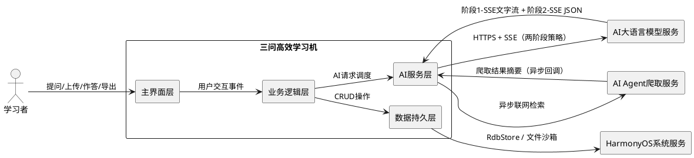
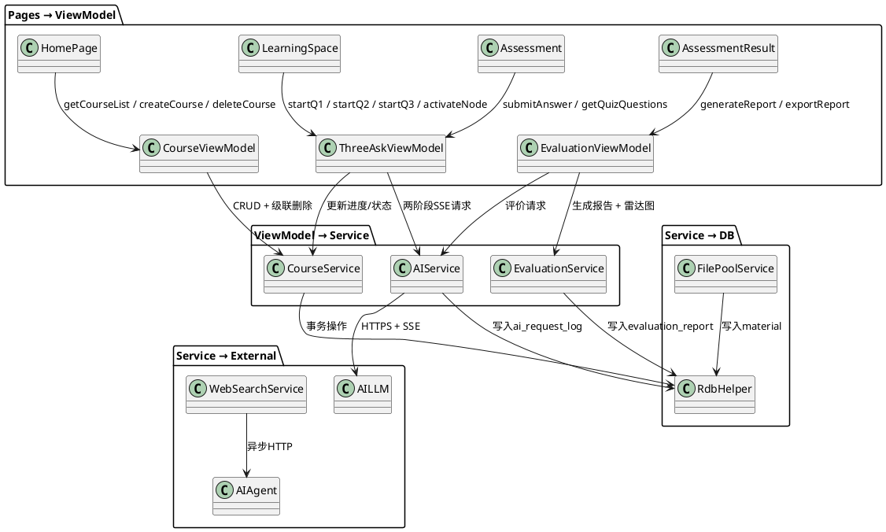
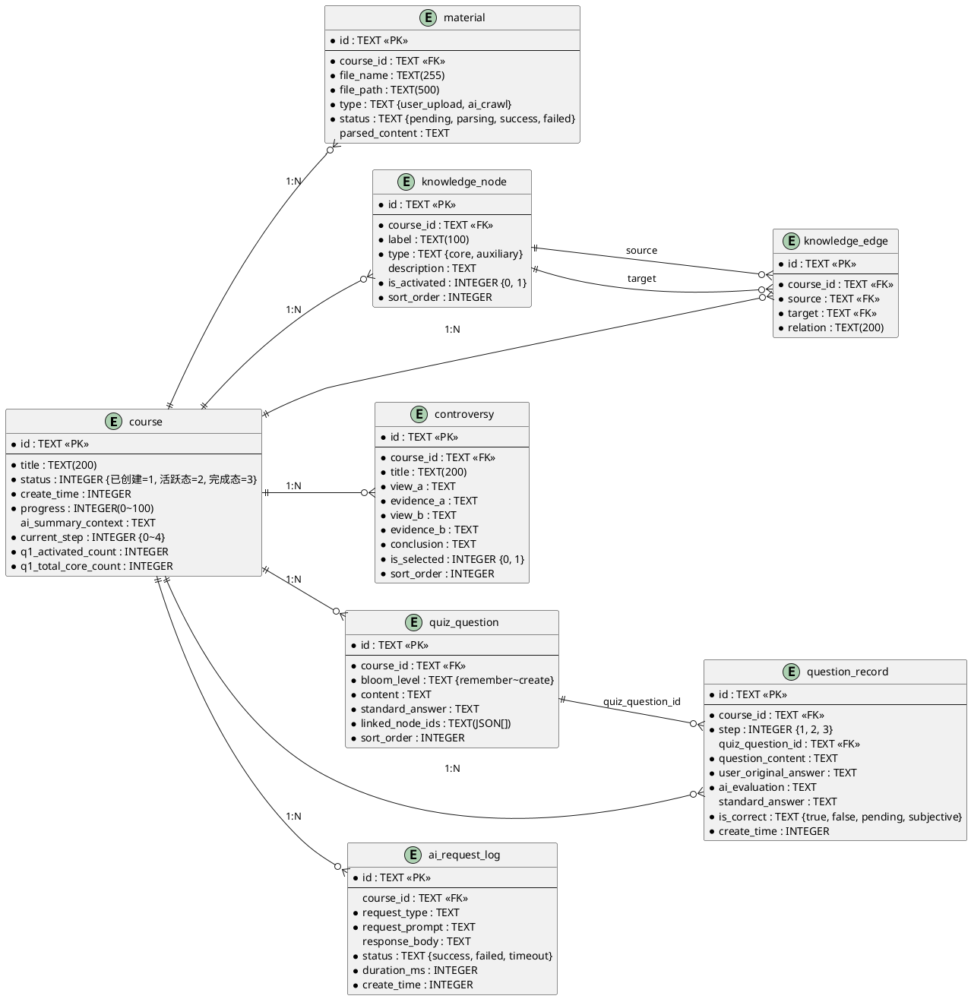
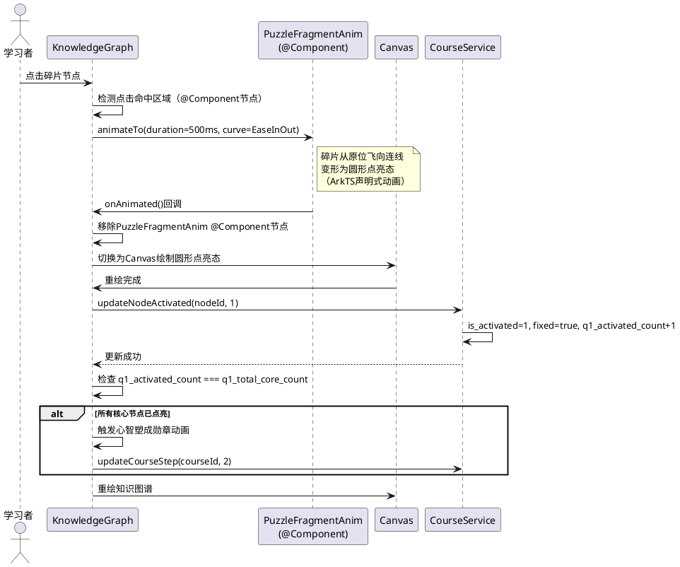
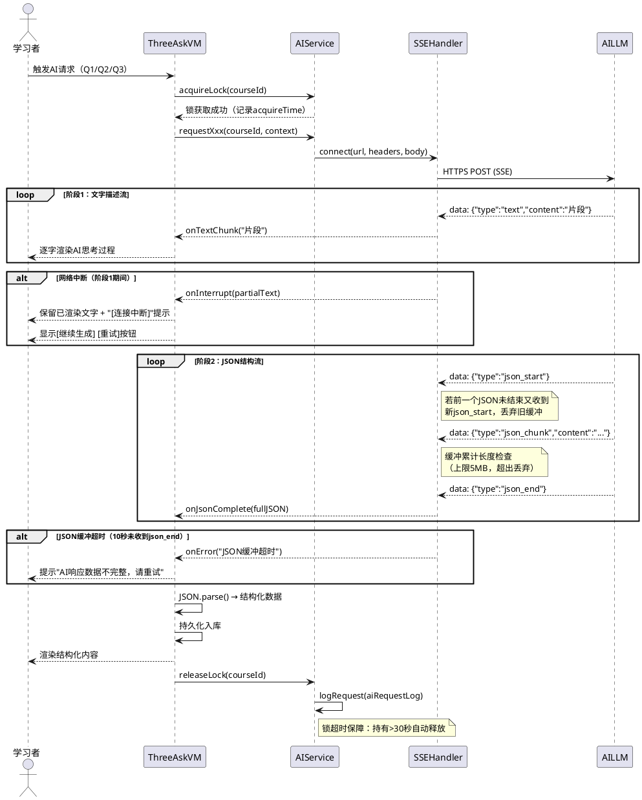
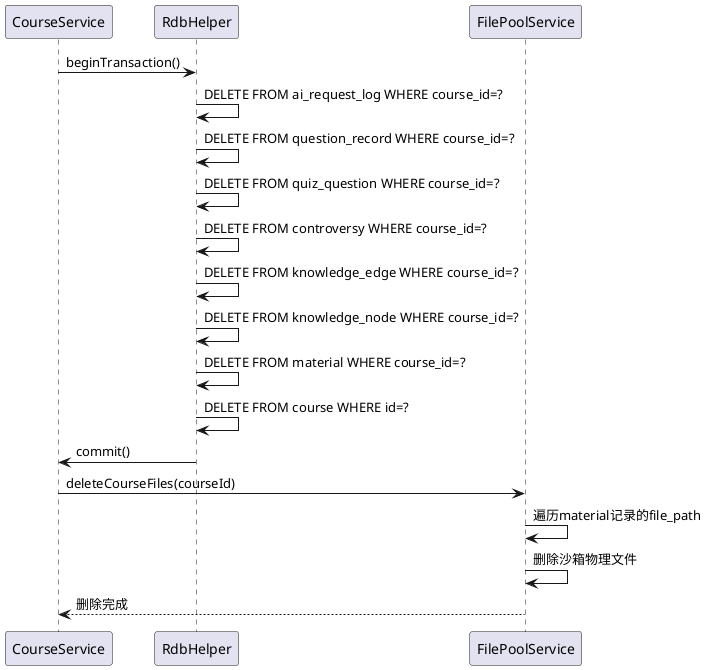
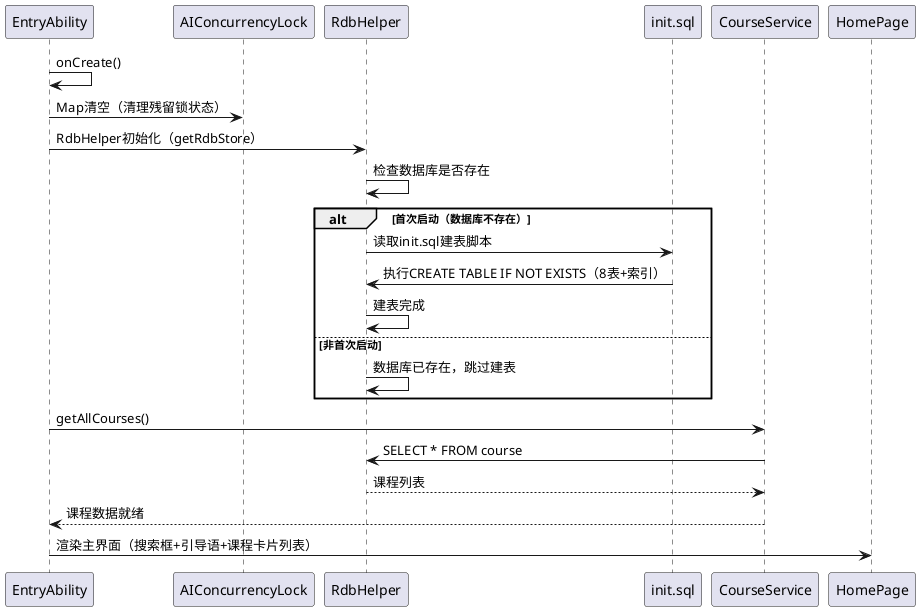

# 三问高效学习机 — 实现方案设计

> 版本：v1.1 | 日期：2026-06-02 | 语言：简体中文 | 基于 spec.md v2.1 EARS需求规格 | 修订：补充架构细节、SSE鲁棒性、数据一致性、边界防御、开发友好性

---

# 1. 实现模型

## 1.1 上下文视图

### 1.1.1 系统上下文



### 1.1.2 外部依赖

| 依赖项 | 版本/规范 | 用途 |
|--------|-----------|------|
| HarmonyOS NEXT API | 12+ | 运行平台基础 |
| ArkTS | 声明式UI范式 | 前端开发语言 |
| Stage模型 | HarmonyOS应用模型 | 生命周期与Ability管理 |
| @kit.ArkData | relationalStore | 关系型数据库RdbStore |
| @kit.NetworkKit | http | HTTPS请求与SSE流式传输 |
| @kit.FileKit | 文件管理 | 沙箱文件读写、系统Picker |
| Canvas API | CanvasRenderingContext2D | 知识图谱（点亮态+连线交互）、雷达图渲染 |
| 力导向布局 | Force-Directed Algorithm（自实现） | 知识图谱节点初始自动排列布局 |
| AI大语言模型服务 | DeepSeek/OpenAI兼容 | 知识图谱生成、争议分析、测评出题、评价反馈 |
| AI Agent爬取服务 | 异步HTTP | 联网检索补充资料 |

## 1.2 服务/组件总体架构

### 1.2.1 分层架构

```plantuml
@startuml
top to bottom direction

package "主界面层（Pages）" {
  [HomePage] -- [LearningSpace] -- [Assessment]
  [AssessmentResult] -- [KnowledgeGraphPage]
}

package "组件层（Components）" {
  [CourseCard] -- [ThreeAskStepper] -- [DebateCard]
  [RadarChart] -- [ProgressBar] -- [ChatBubble]
  [PuzzleFragmentAnim] -- [MindBadgeAnim]
  [ManualInputBox] -- [AIRecommendBtn]
}

package "ViewModel层" {
  [CourseViewModel] -- [ThreeAskViewModel]
  [EvaluationViewModel] -- [HomeViewModel]
}

package "服务层（Services）" {
  [CourseService] -- [AIService] -- [EvaluationService]
  [FilePoolService] -- [MaterialParser] -- [WebSearchService]
  [SSEStreamHandler] -- [AIConcurrencyLock]
}

package "数据持久层（DB）" {
  [RdbHelper] -- [init.sql]
}

package "模型层（Models）" {
  [CourseModel] -- [KnowledgeNodeModel] -- [KnowledgeEdgeModel]
  [ControversyModel] -- [QuizQuestionModel] -- [QuestionRecordModel]
  [MaterialModel] -- [AiRequestLogModel] -- [EvaluationReportModel]
}

[主界面层] --> [组件层]
[主界面层] --> [ViewModel层]
[组件层] --> [ViewModel层]
[ViewModel层] --> [服务层]
[服务层] --> [数据持久层]
[服务层] --> [模型层]
@enduml
```

### 1.2.2 模块划分与职责

| 模块 | 职责 | 关键类/文件 | 对应需求 |
|------|------|-------------|----------|
| **主界面模块** | 搜索框引导语、课程卡片列表、AI推荐提问 | HomePage.ets | REQ-FC-08, REQ-FC-04, REQ-FC-53 |
| **课程管理模块** | 柔性课程CRUD、状态流转、级联删除、进度计算 | CourseService.ets, CourseViewModel.ets | REQ-FC-01~14, REQ-NF-R04 |
| **三问引擎模块** | 三问强制顺序、Stepper管控、Q1/Q2/Q3流程编排 | ThreeAskViewModel.ets, ThreeAskStepper组件 | REQ-FC-15~32 |
| **知识图谱模块** | 图谱生成、力导向布局、混合渲染（碎片@Component+点亮Canvas）、拼图碎片动画、心智塑成勋章、节点激活 | KnowledgeGraphPage.ets, PuzzleFragmentAnim, MindBadgeAnim | REQ-FC-15~21, REQ-FC-52 |
| **争议分析模块** | 左右分栏展示、争议逻辑链、争议点筛选、真人见解输入 | DebateCard.ets, ManualInputBox | REQ-FC-22~24, REQ-FC-44 |
| **深度测评模块** | 布鲁姆9题生成、即时答题解析、错题溯源、真人作答拦截 | Assessment.ets, ManualInputBox | REQ-FC-25~29, REQ-FC-44~46 |
| **AI服务模块** | 两阶段SSE策略、Prompt上下文注入（防幻觉）、并发锁、日志记录 | AIService.ets, SSEStreamHandler, AIConcurrencyLock | REQ-FC-33~36, REQ-NF-M01, REQ-NF-CC01~02 |
| **文件池模块** | 系统Picker选择、PDF/Markdown解析、parsed_content提取、文件命名 | FilePoolService.ets, MaterialParser | REQ-FC-37~43, REQ-NF-C02~03 |
| **评价报告模块** | 报告生成（五大章节）、雷达图Canvas、导出Markdown/PDF | EvaluationService.ets, RadarChart.ets, ReportExporter | REQ-FC-48~51 |
| **数据持久模块** | RdbStore初始化、8表建表、事务原子性、init.sql脚本 | RdbHelper.ets, database/init.sql | REQ-NF-R02~03, REQ-NF-D01~04 |

## 1.3 实现设计文档

### 1.3.1 柔性课程生成实现

**课程创建流程**：

1. 学习者在主界面搜索框输入领域问题文本
2. 输入校验：空文本拦截，提示"请输入您想学习的领域问题"
3. 调用`CourseService.createCourse()`创建课程记录（status=已创建, current_step=0, progress=0）
4. 即时返回课程卡片展示（不等待AI Agent）
5. 异步触发`WebSearchService.crawlRelatedMaterials()`联网检索
6. AI Agent回调后融合资料至复合知识库，异步生成`ai_summary_context`

**课程状态机**：

```
[不存在] → 提问触发 → [已创建(current_step=0)]
[已创建] → 进入Q1 → [活跃态(current_step=1)]
[活跃态] → Q1完成 → [活跃态(current_step=2)]
[活跃态] → Q2完成 → [活跃态(current_step=3)]
[活跃态] → Q3完成 → [完成态(current_step=4)]
任意态 → 删除 → [不存在]（级联删除）
```

**课程进度映射**：

| current_step | 进度 | 含义 |
|:---:|:---:|------|
| 0 | 0% | 未开始 |
| 1 | 0%~33% | Q1进行中（按核心节点点亮比例） |
| 2 | 33% | Q1完成 |
| 3 | 66% | Q2完成 |
| 4 | 100% | Q3完成（课程完成） |

**级联删除实现**：在`RdbHelper`中封装事务，按序删除ai_request_log → question_record → quiz_question → controversy → knowledge_edge → knowledge_node → material → course，最后清理文件池物理文件。**注意**：init.sql中所有外键均不使用`ON DELETE CASCADE`，级联删除完全由代码事务控制，避免SQL级联与代码事务双重删除冲突。

### 1.3.2 三问认知引擎实现

**Stepper进度管控**：
- 使用ArkTS `Stepper`组件，三步分别对应Q1/Q2/Q3
- 通过`current_step`字段控制`StepperItem`的`status`属性（`ItemState.NORMAL`/`ItemState.DISABLE`/`ItemState.SKIP`）
- 前序未完成时后续步骤强制`DISABLE`

**第一问（核心心智模型提取）**：
1. 检查AI并发锁，获取锁后发送Prompt（含parsed_content上下文）
2. 接收两阶段SSE响应：阶段1逐字渲染AI思考过程，阶段2解析JSON获取图谱结构
3. 解析JSON后批量插入`knowledge_node`和`knowledge_edge`表
4. 更新Course的`q1_total_core_count`为核心节点数
5. 知识图谱渲染（混合渲染方案，详见1.3.7），节点初始为拼图碎片状态
6. 学习者点击碎片 → 播放飞向连线动画 → `is_activated=1`, `q1_activated_count+1`，该节点位置锁定（fixed=true）
7. Q1进行中不动态加入新节点
8. 当`q1_activated_count === q1_total_core_count` → 弹出心智塑成勋章 → `current_step=2`

**第二问（学术分歧挖掘）**：
1. 检查AI并发锁，发送Prompt请求争议分析
2. 接收两阶段SSE响应，解析JSON获取争议逻辑链
3. 批量插入`controversy`表
4. 左右分栏渲染：左侧观点A+证据A，右侧观点B+证据B，下方结论
5. 争议点筛选：`Checkbox`组件控制`is_selected`字段
6. 真人见解输入：`ManualInputBox`组件（仅键盘输入，禁粘贴最佳努力）
7. 提交见解后发送AI评价请求，记录存入`question_record`

**第三问（深度测评生成）**：
1. 检查AI并发锁，发送Prompt请求测评题目（指定布鲁姆分布：记忆1+理解2+应用2+分析2+评价1+创造1）
2. 接收两阶段SSE响应，解析JSON获取9道题目
3. **布鲁姆题目分布校验**：解析后立即校验`bloom_level`计数是否符合分布（记忆1+理解2+应用2+分析2+评价1+创造1），不符合时拒绝入库并触发重试（重试上限2次），仍失败时提示"AI生成题目质量不足，请重试"
4. 批量插入`quiz_question`表（含`linked_node_ids`JSON数组）
4. 逐题展示，仅提供手动文本输入框（`ManualInputBox`）
5. 提交答案 → 即时显示解析 → 记录存入`question_record`（含`create_time`）
6. 答错题目通过`linked_node_ids`追溯到知识图谱薄弱节点并标注
7. 全部完成后 → `current_step=4` → 触发评价报告生成

### 1.3.3 AI服务两阶段SSE策略实现

**SSE流式处理架构**：

```
[AI服务HTTP响应]
  ↓ SSE EventStream
[SSEStreamHandler]
  ↓ 阶段1: data: {"type":"text","content":"..."}  → 逐字渲染到UI
  ↓ 阶段2: data: {"type":"json_start"} ... data: {"type":"json_end"} → 缓冲完整JSON
  ↓
[JSON解析] → [结构化数据] → [持久化入库] → [UI渲染]
```

**阶段1（文字描述流）**：
- SSE事件中`type=text`的片段逐字追加到UI文本区域
- 使用`@State`驱动ArkTS声明式渲染，实现逐字打字效果
- **网络中断处理**：阶段1逐字渲染期间网络断开时，UI保留已渲染的部分文字，追加"[连接中断]"提示，并提供"继续生成"和"重试"两个按钮（而非仅关闭连接）

**阶段2（JSON结构流）**：
- SSE事件中`type=json_start`标记开始，后续片段缓冲至完整JSON
- `type=json_end`标记结束，执行`JSON.parse()`解析
- 解析失败时记录日志（status=failed），尝试降级或提示重试
- **缓冲超时机制**：若`json_end`在10秒内未到达，丢弃当前缓冲并触发错误回调（`onError`），提示"AI响应数据不完整，请重试"
- **分片乱序防护**：若前一个JSON缓冲未结束（未收到`json_end`）又收到新的`json_start`，丢弃旧缓冲，以新`json_start`重新开始缓冲
- **JSON最大长度限制**：缓冲累计长度上限5MB，超出时丢弃缓冲并触发错误回调，防止内存溢出

**Prompt上下文注入（防幻觉）**：
- 构建Prompt时，从`material`表查询该课程所有`parsed_content`
- 将`parsed_content`拼接为上下文段注入system message
- 约束指令："请严格基于以下参考资料回答，不得编造资料中不存在的信息"

**AI请求并发锁**：
- `AIConcurrencyLock`维护`Map<courseId, {locked: boolean, acquireTime: number}>`锁状态
- 请求前检查锁状态，锁定时禁用触发按钮+显示加载态
- 请求完成/失败/超时后释放锁，记录日志至`ai_request_log`
- **锁超时机制**：每个锁设置最大持有时间30秒，超时自动释放（定时器检查`Date.now() - acquireTime > 30000`时强制releaseLock）
- **冷启动清理**：应用`EntryAbility.onCreate()`时清空`AIConcurrencyLock`的Map，确保无残留锁状态

### 1.3.4 文件池与资料解析实现

**资料上传流程**：
1. 长按课程卡片 → 弹出系统Picker（`@kit.FileKit`的`DocumentViewPicker`）
2. 选择PDF/Markdown文件 → 校验格式与大小（≤50MB）
3. 复制文件至应用沙箱（`context.filesDir`），重名追加时间戳后缀
4. 调用`MaterialParser`解析文件内容
5. 解析成功 → `parsed_content`提取纯文本 → 存入`material`表（status=success）
6. 解析失败 → 标记status=failed，提示错误

**PDF解析（文本型）**：
- 使用`@kit.FileKit`读取PDF文件
- 调用`pdfKit.getText()`提取纯文本（仅支持文本型PDF）
- **扫描型PDF检测逻辑（isScannedPDF）**：调用`pdfKit`获取页面数N，若提取文本长度 < N × 50（字符），判定为扫描型PDF
- 检测为扫描型时提示"该PDF为图片格式，暂不支持解析"，标记`status=failed`
- 提取成功后存入`material.parsed_content`

**Markdown解析**：
- 读取文件全文为字符串
- 去除Markdown格式标记（`#`、`**`、`[]()`等），保留纯文本语义
- 存入`material.parsed_content`

**资料解析失败后的状态流转**：
- 失败资料（`status=failed`）不影响三问引擎启动，复合知识库查询使用`WHERE status='success'`过滤
- 失败资料的`parsed_content`为空，三问引擎自动跳过
- 学习者可重新上传覆盖失败记录：同一`file_name`的资料重新上传时，覆盖原记录（更新`file_path`、`parsed_content`、`status`）

**AI爬取资料融合**：
- AI Agent返回爬取结果后，以`type=ai_crawl`标识存入`material`表
- 与用户上传资料（`type=user_upload`）共同构成复合知识库
- 三问引擎请求AI时，从复合知识库提取全部`parsed_content`作为上下文注入

### 1.3.5 评价报告与导出实现

**报告生成流程**：
1. Q3全部完成 → 收集三问全部交互记录
2. 调用AI生成评价反馈（概念理解、批判思维、实践迁移三维度评分）
3. Canvas绘制三维度雷达图 → 保存为`{course_id}_radar.png`
4. 执行错题溯源：遍历`question_record`中`is_correct=false`的记录，通过`linked_node_ids`关联知识图谱薄弱节点
5. 按标准模板五大章节组装报告Markdown

**评价报告标准模板（五大章节）**：

```markdown
# 学习评价报告：{课程标题}

> 本答案由学员手动输入（诚信声明）

## 一、学习课题
{课程标题} | 完成时间：{completion_time}

## 二、复合知识库构成
- 用户上传资料：{user_upload_count}份（{file_names}）
- AI爬取资料：{ai_crawl_count}份

## 三、三问交互原始记录
### 第一问：核心心智模型提取
{Q1对话原文}
### 第二问：学术分歧挖掘
{Q2对话原文}
### 第三问：深度测评
{Q3对话原文}
{可疑记录提示：若存在is_suspect=true的记录，追加"⚠ 部分作答时间异常，已标记审计"}

## 四、能力维度分析

- 概念理解：{concept_understanding}分
- 批判思维：{critical_thinking}分
- 实践迁移：{practical_transfer}分

## 五、错题溯源与复习建议
{错题关联薄弱节点列表}
{AI复习建议}
```

**导出实现**：
- **Markdown导出**：直接写入`.md`文件至用户指定目录
- **PDF导出**：将Markdown转HTML后使用PDF渲染组件生成`.pdf`文件
- 雷达图以相对路径`./{course_id}_radar.png`嵌入Markdown

### 1.3.6 关键交互实现

**拼图碎片动画**：
- 知识图谱节点初始渲染为不规则碎片形状——采用混合渲染方案：碎片态使用独立`@Component`节点（`PuzzleFragmentAnim`）渲染，可参与ArkTS `animateTo()`动画
- 点击碎片 → 触发`animateTo()`动画：碎片从原位飞向对应连线位置 → 变形为圆形点亮态
- 动画参数：duration=500ms, curve=Curve.EaseInOut
- 动画完成后：移除`@Component`碎片节点 → 切换为Canvas绘制圆形点亮态 → 更新`is_activated=1`，重绘Canvas

**心智塑成勋章动画**：
- 当最后一个核心节点被点亮时触发
- 弹出全屏遮罩 + 中央勋章图标 + 粒子扩散动画
- 勋章图标使用Lottie或Canvas绘制，持续2秒后自动消失
- 同步更新`current_step=2`解锁Q2

**真人作答拦截**：
- Q2见解输入和Q3答题输入均使用`ManualInputBox`组件
- 组件内部：`TextInput`设置`type=InputType.Normal`，`enableKeyboard=true`
- 粘贴板禁用（最佳努力）：监听`onPaste`事件并拦截，设置`copyOption=CopyOptions.None`
- Prompt约束：system message中追加"禁止替代用户作答，必须基于用户真实输入评价"
- 评价报告标注"本答案由学员手动输入"
- **降级防线**：即使粘贴成功，AI也被Prompt约束禁止评价非学员原创内容
- **诚信审计**：结合对话记录时间戳审计——若作答提交时间与AI响应返回时间间隔过短（<2秒），标记该记录为可疑（`is_suspect=true`），评价报告中注明

### 1.3.7 知识图谱布局算法与混合渲染方案

**力导向布局算法（Force-Directed Layout）**：
- 初始布局采用力导向算法自动排列节点，避免节点重叠
- 布局参数：
  - 节点最小间距：60px
  - 边的长度偏好：120px
  - 迭代次数：200次或收敛条件（所有节点位移<1px时提前终止）
- 算线：`KnowledgeGraphPage.onAppear()` → 计算力导向布局 → 确定各节点(x, y)坐标 → 渲染

**节点位置锁定**：
- 节点被点击后（`is_activated=1`），该节点位置锁定（`fixed=true`），不再参与力导向迭代
- Q1进行期间不动态加入新节点，布局稳定

**混合渲染方案（方案B）**：
- 知识图谱的Canvas自绘和ArkTS组件树属于不同渲染体系，`animateTo()`无法直接作用于Canvas自绘内容
- **碎片态渲染**：每个知识节点在碎片态时使用独立的`@Component`节点（`PuzzleFragmentAnim`）渲染，可参与ArkTS `animateTo()`动画系统
- **点亮态切换**：碎片飞向连线动画完成后，移除`@Component`节点，切换为Canvas绘制该节点（圆形点亮态），后续交互（点击查看详情、连线查看关系）均在Canvas内处理
- **切换时机**：`PuzzleFragmentAnim.onAnimated()`回调 → 移除组件节点 → Canvas重绘该节点为点亮态 → 更新`is_activated=1`
- **优势**：碎片动画利用ArkTS声明式动画能力，点亮后Canvas统一渲染保证交互性能

---

# 2. 接口设计

## 2.1 总体设计

### 2.1.1 内部接口架构



## 2.2 接口清单

### 2.2.1 CourseService 接口

| 方法签名 | 功能 | 对应需求 |
|----------|------|----------|
| `createCourse(title: string): Promise<CourseModel>` | 创建课程（status=已创建, current_step=0） | REQ-FC-01 |
| `getAllCourses(): Promise<CourseModel[]>` | 查询全部课程列表 | REQ-FC-04 |
| `getCourseById(id: string): Promise<CourseModel \| null>` | 按ID查询课程 | - |
| `updateCourseStep(id: string, step: number): Promise<void>` | 更新current_step | REQ-FC-10~13 |
| `updateCourseProgress(id: string, progress: number): Promise<void>` | 更新进度百分比 | REQ-FC-05~07 |
| `updateQ1Counts(id: string, activated: number, total: number): Promise<void>` | 更新Q1点亮计数 | REQ-FC-21 |
| `cascadeDeleteCourse(id: string): Promise<void>` | 级联删除课程及关联数据+物理文件 | REQ-FC-14, REQ-NF-R04 |

### 2.2.2 AIService 接口

| 方法签名 | 功能 | 对应需求 |
|----------|------|----------|
| `requestKnowledgeGraph(courseId: string, context: string): Promise<SSEStream>` | Q1知识图谱生成（两阶段SSE） | REQ-FC-15, REQ-FC-33~34 |
| `requestControversy(courseId: string, context: string): Promise<SSEStream>` | Q2争议分析（两阶段SSE） | REQ-FC-22, REQ-FC-33~34 |
| `requestQuizQuestions(courseId: string, context: string): Promise<SSEStream>` | Q3测评出题（两阶段SSE，布鲁姆分布） | REQ-FC-25, REQ-FC-33~34 |
| `requestEvaluation(courseId: string, userAnswer: string, context: string): Promise<AIResponse>` | 答案评价反馈 | REQ-FC-27 |
| `requestInsightEvaluation(courseId: string, insight: string, context: string): Promise<AIResponse>` | Q2见解评价 | REQ-FC-24 |
| `acquireLock(courseId: string): boolean` | 获取AI并发锁（记录acquireTime） | REQ-NF-CC01 |
| `releaseLock(courseId: string): void` | 释放AI并发锁 | REQ-NF-CC02 |
| `forceReleaseTimeout(): void` | 检查并强制释放超时锁（持有>30秒） | REQ-NF-CC02 |
| `clearAllOnColdStart(): void` | 冷启动时清空Map，清理残留锁状态 | REQ-NF-CC02 |
| `logRequest(log: AiRequestLogModel): Promise<void>` | 记录AI请求日志 | REQ-NF-M01 |

### 2.2.3 SSEStreamHandler 接口

| 方法签名 | 功能 | 对应需求 |
|----------|------|----------|
| `connect(url: string, headers: Record<string, string>, body: string): Promise<void>` | 建立SSE连接 | REQ-FC-34 |
| `onTextChunk(callback: (text: string) => void): void` | 注册阶段1文字片段回调 | REQ-FC-34 |
| `onJsonComplete(callback: (json: string) => void): void` | 注册阶段2 JSON完成回调 | REQ-FC-34 |
| `onError(callback: (error: Error) => void): void` | 注册错误回调 | REQ-NF-R01 |
| `onInterrupt(callback: (partialText: string) => void): void` | 注册阶段1网络中断回调（返回已渲染部分文字） | REQ-NF-R01 |
| `retry(): Promise<void>` | 重试当前SSE请求（继续生成或重新请求） | REQ-NF-R01 |
| `close(): void` | 关闭SSE连接 | - |

**SSE缓冲配置常量**：

| 常量 | 值 | 说明 |
|------|-----|------|
| `JSON_BUFFER_TIMEOUT_MS` | 10000 | JSON缓冲超时时间（10秒） |
| `JSON_MAX_LENGTH_BYTES` | 5242880 | JSON缓冲最大长度（5MB） |

### 2.2.4 FilePoolService 接口

| 方法签名 | 功能 | 对应需求 |
|----------|------|----------|
| `selectFileByPicker(): Promise<FileInfo \| null>` | 系统Picker选择文件 | REQ-FC-37, REQ-NF-A02 |
| `copyToSandbox(sourceUri: string, fileName: string): Promise<string>` | 复制文件至沙箱（重名追加时间戳） | REQ-FC-42, REQ-NF-S01 |
| `parseMaterial(filePath: string, fileType: string): Promise<ParsedResult>` | 解析PDF/Markdown提取纯文本 | REQ-FC-43, REQ-NF-C02~03 |
| `saveMaterialRecord(courseId: string, fileInfo: FileInfo, parsedContent: string): Promise<MaterialModel>` | 保存资料记录至DB | REQ-FC-38~39 |
| `deleteCourseFiles(courseId: string): Promise<void>` | 删除课程关联物理文件 | REQ-FC-14 |

### 2.2.5 EvaluationService 接口

| 方法签名 | 功能 | 对应需求 |
|----------|------|----------|
| `generateReport(courseId: string): Promise<EvaluationReportModel>` | 生成评价报告（五大章节） | REQ-FC-48, REQ-FC-51 |
| `drawRadarChart(courseId: string, scores: number[]): Promise<string>` | Canvas绘制雷达图并保存为PNG | REQ-FC-49 |
| `traceWeakNodes(courseId: string): Promise<WeakNodeTrace[]>` | 错题溯源关联薄弱节点 | REQ-FC-28 |
| `exportMarkdown(report: EvaluationReportModel): Promise<string>` | 导出Markdown格式报告 | REQ-FC-50 |
| `exportPDF(report: EvaluationReportModel): Promise<string>` | 导出PDF格式报告 | REQ-FC-50 |

### 2.2.6 MaterialParser 接口

| 方法签名 | 功能 | 对应需求 |
|----------|------|----------|
| `parsePDF(filePath: string): Promise<ParsedResult>` | 解析文本型PDF提取纯文本 | REQ-NF-C02 |
| `parseMarkdown(filePath: string): Promise<ParsedResult>` | 解析Markdown提取纯文本 | REQ-NF-C02 |
| `isScannedPDF(filePath: string): Promise<boolean>` | 检测是否为扫描型PDF（页面数N，文本长度 < N×50 则判定为扫描型） | REQ-NF-C03 |

```typescript
interface ParsedResult {
  success: boolean
  content: string        // parsed_content纯文本
  isScanned: boolean     // 是否扫描型PDF
  error: string          // 错误信息
}
```

---

# 3. 数据模型

## 3.1 设计目标

1. **完整覆盖8张核心业务表**：course, material, knowledge_node, knowledge_edge, controversy, quiz_question, question_record, ai_request_log
2. **关系型数据库RdbStore**：使用HarmonyOS `@kit.ArkData`的`relationalStore`
3. **原子性事务保障**：级联删除、批量插入使用事务包裹（REQ-NF-R03）
4. **首次启动自动建表**：执行`database/init.sql`脚本（REQ-NF-D01）
5. **强类型模型映射**：ArkTS interface与表结构一一对应
6. **级联删除策略统一**：init.sql中所有外键均不使用`ON DELETE CASCADE`，级联删除完全由代码事务控制（避免SQL级联与代码事务双重删除冲突）

## 3.2 模型实现

### 3.2.1 ER关系图



### 3.2.2 建表SQL脚本（database/init.sql）

```sql
-- ============================================================
-- 三问高效学习机 - 数据库初始化脚本
-- 版本: v1.0 | 数据库: ThreeAskScholar.db
-- ============================================================

-- 1. 课程表
CREATE TABLE IF NOT EXISTS course (
  id                   TEXT PRIMARY KEY,
  title                TEXT NOT NULL,
  status               INTEGER NOT NULL DEFAULT 1,       -- 1=已创建, 2=活跃态, 3=完成态
  create_time          INTEGER NOT NULL,
  progress             INTEGER NOT NULL DEFAULT 0,       -- 0~100
  ai_summary_context   TEXT,
  current_step         INTEGER NOT NULL DEFAULT 0,       -- 0=未开始,1=Q1中,2=Q2中,3=Q3中,4=已完成
  q1_activated_count   INTEGER NOT NULL DEFAULT 0,
  q1_total_core_count  INTEGER NOT NULL DEFAULT 0
);

-- 2. 资料表
CREATE TABLE IF NOT EXISTS material (
  id              TEXT PRIMARY KEY,
  course_id       TEXT NOT NULL,
  file_name       TEXT NOT NULL,
  file_path       TEXT NOT NULL,
  type            TEXT NOT NULL,            -- user_upload / ai_crawl
  status          TEXT NOT NULL DEFAULT 'pending',  -- pending/parsing/success/failed
  parsed_content  TEXT,
  FOREIGN KEY (course_id) REFERENCES course(id)
);

-- 3. 知识节点表
CREATE TABLE IF NOT EXISTS knowledge_node (
  id           TEXT PRIMARY KEY,
  course_id    TEXT NOT NULL,
  label        TEXT NOT NULL,
  type         TEXT NOT NULL,              -- core / auxiliary
  description  TEXT,
  is_activated INTEGER NOT NULL DEFAULT 0, -- 0=碎片态, 1=点亮态
  sort_order   INTEGER NOT NULL DEFAULT 0,
  FOREIGN KEY (course_id) REFERENCES course(id)
);

-- 4. 知识边表
CREATE TABLE IF NOT EXISTS knowledge_edge (
  id         TEXT PRIMARY KEY,
  course_id  TEXT NOT NULL,
  source     TEXT NOT NULL,
  target     TEXT NOT NULL,
  relation   TEXT NOT NULL,
  FOREIGN KEY (course_id) REFERENCES course(id),
  FOREIGN KEY (source) REFERENCES knowledge_node(id),
  FOREIGN KEY (target) REFERENCES knowledge_node(id)
);

-- 5. 争议表
CREATE TABLE IF NOT EXISTS controversy (
  id          TEXT PRIMARY KEY,
  course_id   TEXT NOT NULL,
  title       TEXT NOT NULL,
  view_a      TEXT NOT NULL,
  evidence_a  TEXT NOT NULL,
  view_b      TEXT NOT NULL,
  evidence_b  TEXT NOT NULL,
  conclusion  TEXT NOT NULL,
  is_selected INTEGER NOT NULL DEFAULT 0,
  sort_order  INTEGER NOT NULL DEFAULT 0,
  FOREIGN KEY (course_id) REFERENCES course(id)
);

-- 6. 测评题目表
CREATE TABLE IF NOT EXISTS quiz_question (
  id               TEXT PRIMARY KEY,
  course_id        TEXT NOT NULL,
  bloom_level      TEXT NOT NULL,          -- remember/understand/apply/analyze/evaluate/create
  content          TEXT NOT NULL,
  standard_answer  TEXT NOT NULL,
  linked_node_ids  TEXT NOT NULL,          -- JSON数组，如["node1","node2"]
  sort_order       INTEGER NOT NULL DEFAULT 0,
  FOREIGN KEY (course_id) REFERENCES course(id)
);

-- 7. 作答记录表
CREATE TABLE IF NOT EXISTS question_record (
  id                  TEXT PRIMARY KEY,
  course_id           TEXT NOT NULL,
  step                INTEGER NOT NULL,     -- 1/2/3
  quiz_question_id    TEXT,                 -- 第三问时必填
  question_content    TEXT NOT NULL,
  user_original_answer TEXT NOT NULL,
  ai_evaluation       TEXT NOT NULL,
  standard_answer     TEXT,
  is_correct          TEXT NOT NULL DEFAULT 'pending',  -- true/false/pending/subjective
  is_suspect          INTEGER NOT NULL DEFAULT 0,       -- 0=正常, 1=可疑（作答与AI响应间隔<2秒）
  create_time         INTEGER NOT NULL,
  FOREIGN KEY (course_id) REFERENCES course(id),
  FOREIGN KEY (quiz_question_id) REFERENCES quiz_question(id) ON DELETE SET NULL
);

-- 8. AI请求日志表
CREATE TABLE IF NOT EXISTS ai_request_log (
  id              TEXT PRIMARY KEY,
  course_id       TEXT,
  request_type    TEXT NOT NULL,            -- knowledge_graph/controversy/quiz/evaluation等
  request_prompt  TEXT NOT NULL,
  response_body   TEXT,
  status          TEXT NOT NULL,            -- success/failed/timeout
  duration_ms     INTEGER NOT NULL,
  create_time     INTEGER NOT NULL,
  FOREIGN KEY (course_id) REFERENCES course(id)
);

-- 索引
CREATE INDEX IF NOT EXISTS idx_material_course ON material(course_id);
CREATE INDEX IF NOT EXISTS idx_knode_course ON knowledge_node(course_id);
CREATE INDEX IF NOT EXISTS idx_kedge_course ON knowledge_edge(course_id);
CREATE INDEX IF NOT EXISTS idx_controversy_course ON controversy(course_id);
CREATE INDEX IF NOT EXISTS idx_quiz_course ON quiz_question(course_id);
CREATE INDEX IF NOT EXISTS idx_qrecord_course ON question_record(course_id);
CREATE INDEX IF NOT EXISTS idx_ailog_course ON ai_request_log(course_id);
CREATE INDEX IF NOT EXISTS idx_knode_activated ON knowledge_node(course_id, is_activated);
CREATE INDEX IF NOT EXISTS idx_qrecord_time ON question_record(create_time);
```

### 3.2.3 ArkTS模型接口

```typescript
// ---- Course ----
interface CourseModel {
  id: string
  title: string
  status: CourseStatus          // 1=已创建, 2=活跃态, 3=完成态
  createTime: number
  progress: number              // 0~100
  aiSummaryContext: string
  currentStep: number           // 0~4
  q1ActivatedCount: number
  q1TotalCoreCount: number
}

enum CourseStatus { CREATED = 1, ACTIVE = 2, COMPLETED = 3 }

// ---- Material ----
interface MaterialModel {
  id: string
  courseId: string
  fileName: string
  filePath: string
  type: MaterialType            // 'user_upload' | 'ai_crawl'
  status: MaterialStatus        // 'pending' | 'parsing' | 'success' | 'failed'
  parsedContent: string
}

type MaterialType = 'user_upload' | 'ai_crawl'
type MaterialStatus = 'pending' | 'parsing' | 'success' | 'failed'

// ---- KnowledgeNode ----
interface KnowledgeNodeModel {
  id: string
  courseId: string
  label: string
  type: NodeType                 // 'core' | 'auxiliary'
  description: string
  isActivated: number           // 0 | 1
  sortOrder: number
}

type NodeType = 'core' | 'auxiliary'

// ---- KnowledgeEdge ----
interface KnowledgeEdgeModel {
  id: string
  courseId: string
  source: string
  target: string
  relation: string
}

// ---- Controversy ----
interface ControversyModel {
  id: string
  courseId: string
  title: string
  viewA: string
  evidenceA: string
  viewB: string
  evidenceB: string
  conclusion: string
  isSelected: number            // 0 | 1
  sortOrder: number
}

// ---- QuizQuestion ----
interface QuizQuestionModel {
  id: string
  courseId: string
  bloomLevel: BloomLevel
  content: string
  standardAnswer: string
  linkedNodeIds: string[]       // JSON数组解析后
  sortOrder: number
}

type BloomLevel = 'remember' | 'understand' | 'apply' | 'analyze' | 'evaluate' | 'create'

// ---- QuestionRecord ----
interface QuestionRecordModel {
  id: string
  courseId: string
  step: number                   // 1 | 2 | 3
  quizQuestionId: string
  questionContent: string
  userOriginalAnswer: string
  aiEvaluation: string
  standardAnswer: string
  isCorrect: CorrectStatus       // 'true' | 'false' | 'pending' | 'subjective'
  isSuspect: boolean             // 诚信审计标记：作答与AI响应间隔<2秒时为true
  createTime: number
}

type CorrectStatus = 'true' | 'false' | 'pending' | 'subjective'

// ---- AiRequestLog ----
interface AiRequestLogModel {
  id: string
  courseId: string
  requestType: string            // 'knowledge_graph' | 'controversy' | 'quiz' | 'evaluation'
  requestPrompt: string
  responseBody: string
  status: LogStatus              // 'success' | 'failed' | 'timeout'
  durationMs: number
  createTime: number
}

type LogStatus = 'success' | 'failed' | 'timeout'
```

---

# 4. 页面与组件设计

## 4.1 页面清单

| 页面 | 路径 | 功能 | 关键组件 |
|------|------|------|----------|
| 主界面 | pages/home/HomePage.ets | 搜索框+引导语+课程卡片列表+AI推荐提问 | SearchBar, CourseCard, AIRecommendBtn |
| 学习空间 | pages/learning/LearningSpace.ets | 三问Stepper容器 | ThreeAskStepper, Q1Panel, Q2Panel, Q3Panel |
| 知识图谱 | pages/learning/KnowledgeGraph.ets | Canvas渲染知识图谱+拼图碎片动画 | PuzzleFragmentAnim, MindBadgeAnim |
| 测评 | pages/assessment/Assessment.ets | 布鲁姆9题答题 | ManualInputBox, QuizCard |
| 评价报告 | pages/assessment/AssessmentResult.ets | 报告展示+导出 | RadarChart, ReportExporter |

## 4.2 组件清单

| 组件 | 功能 | 关键属性/事件 | 对应需求 |
|------|------|---------------|----------|
| **CourseCard** | 课程卡片（名称+进度条+雷达图缩略图） | `course: CourseModel`, `onLongPress: () => void` | REQ-FC-04 |
| **ThreeAskStepper** | 三问进度Stepper | `currentStep: number`, `onStepChange: (step) => void` | REQ-FC-30~32 |
| **PuzzleFragmentAnim** | 拼图碎片动画（碎片态@Component渲染，动画完成后切换Canvas） | `nodeId: string`, `onActivated: () => void`, `onAnimated: () => void` | REQ-FC-16~17 |
| **MindBadgeAnim** | 心智塑成勋章动画 | `visible: boolean`, `onComplete: () => void` | REQ-FC-18 |
| **DebateCard** | 争议分栏卡片（左观点A+右观点B+结论） | `controversy: ControversyModel`, `onSelect: () => void` | REQ-FC-22~23 |
| **ManualInputBox** | 真人手动输入框（禁粘贴最佳努力） | `placeholder: string`, `onSubmit: (text) => void`, `copyOption=CopyOptions.None` | REQ-FC-24,29,44~45 |
| **RadarChart** | Canvas三维度雷达图 | `scores: number[]`, `labels: string[]`, `size: number` | REQ-FC-49 |
| **ProgressBar** | 课程进度条 | `progress: number` (0~100) | REQ-FC-05~07 |
| **AIRecommendBtn** | AI推荐提问按钮 | `questions: string[]`, `onSelect: (q) => void` | REQ-FC-40,53 |
| **ChatBubble** | AI对话气泡（逐字渲染） | `content: string`, `isStreaming: boolean` | REQ-FC-34 |

## 4.3 关键页面布局

### 4.3.1 主界面布局

```
┌─────────────────────────────┐
│  🔍 搜索框                   │  ← 仅搜索框+引导语（REQ-FC-08）
│  "输入您想学习的领域问题"      │
├─────────────────────────────┤
│  AI推荐提问按钮列表            │  ← REQ-FC-53
│  [推荐问题1] [推荐问题2] ...  │
├─────────────────────────────┤
│  课程卡片列表（ScrollView）    │
│  ┌───────────────────────┐  │
│  │ 课程名称    进度条 33%  │  │  ← CourseCard
│  │ [雷达图缩略]           │  │
│  └───────────────────────┘  │
│  ┌───────────────────────┐  │
│  │ ...                    │  │
│  └───────────────────────┘  │
└─────────────────────────────┘
```

### 4.3.2 学习空间布局（三问Stepper）

```
┌─────────────────────────────┐
│  Stepper: [①Q1] [②Q2] [③Q3] │  ← ThreeAskStepper
├─────────────────────────────┤
│  Q1面板:                     │
│  ┌───────────────────────┐  │
│  │ 知识图谱（混合渲染）    │  │  ← 碎片态: PuzzleFragmentAnim(@Component)
│  │ 碎片→点亮动画→Canvas   │  │  ← 点亮态: Canvas绘制
│  └───────────────────────┘  │
│  [心智塑成勋章]              │  ← MindBadgeAnim（Q1完成触发）
├─────────────────────────────┤
│  Q2面板:                     │
│  ┌──────────┬──────────┐   │
│  │ 观点A    │ 观点B     │   │  ← DebateCard左右分栏
│  │ 证据A    │ 证据B     │   │
│  ├──────────┴──────────┤   │
│  │ 结论                 │   │
│  └─────────────────────┘   │
│  [争议点筛选Checkbox]        │
│  [真人见解输入ManualInputBox] │
├─────────────────────────────┤
│  Q3面板:                     │
│  题目1 (布鲁姆层级标签)       │
│  [真人答题ManualInputBox]    │
│  [提交] → 即时解析+错题溯源   │
│  题目2 ...                   │
│  ... 题目9                   │
└─────────────────────────────┘
```

### 4.3.3 评价报告页面布局

```
┌─────────────────────────────┐
│  学习评价报告：{课程标题}      │
│  > 本答案由学员手动输入        │
├─────────────────────────────┤
│  一、学习课题                 │
│  二、复合知识库构成            │
│  三、三问交互原始记录          │
│  四、能力维度分析              │
│  ┌───────────────────────┐  │
│  │ 雷达图Canvas            │  │  ← RadarChart
│  │ (概念理解/批判思维/实践迁移)│
│  └───────────────────────┘  │
│  五、错题溯源与复习建议        │
├─────────────────────────────┤
│  [导出Markdown] [导出PDF]     │
└─────────────────────────────┘
```

---

# 5. 关键交互流程设计

## 5.1 拼图碎片动画流程（混合渲染方案）



## 5.2 两阶段SSE交互流程



## 5.3 课程级联删除流程



## 5.4 应用冷启动初始化时序



## 5.5 知识图谱节点ID生成策略

AI返回的知识图谱JSON中包含AI生成的节点ID，入库前需替换为系统生成的UUID，确保全局唯一性：

1. AI返回JSON解析后，遍历`nodes`数组，为每个节点建立`aiId → systemUUID`映射
2. 用系统生成的UUID覆盖每个节点的`id`字段
3. 遍历`edges`数组，将`source`和`target`字段中的AI_ID替换为对应的系统UUID
4. 替换完成后批量插入`knowledge_node`和`knowledge_edge`表

```typescript
// 节点ID替换伪代码
const idMapping: Map<string, string> = new Map()
for (const node of parsedNodes) {
  const systemId = util.generateRandomUUID()
  idMapping.set(node.id, systemId)
  node.id = systemId
}
for (const edge of parsedEdges) {
  edge.source = idMapping.get(edge.source) ?? edge.source
  edge.target = idMapping.get(edge.target) ?? edge.target
}
```

---

# 6. 项目目录结构

```
三问高效学习机/
├── entry/                              # HarmonyOS应用主模块
│   └── src/main/
│       ├── ets/                        # ArkTS源码
│       │   ├── entryability/
│       │   │   └── EntryAbility.ets    # 应用入口Ability
│       │   ├── pages/                  # 页面
│       │   │   ├── home/
│       │   │   │   └── HomePage.ets    # 主界面（搜索框+课程列表）
│       │   │   ├── learning/
│       │   │   │   ├── LearningSpace.ets   # 学习空间（三问Stepper容器）
│       │   │   │   └── KnowledgeGraph.ets  # 知识图谱Canvas页面
│       │   │   └── assessment/
│       │   │       ├── Assessment.ets       # 深度测评答题页
│       │   │       └── AssessmentResult.ets # 评价报告页
│       │   ├── components/             # 可复用组件
│       │   │   ├── CourseCard.ets      # 课程卡片
│       │   │   ├── ThreeAskStepper.ets # 三问进度Stepper
│       │   │   ├── ThreeAskIndicator.ets # 三问指示器
│       │   │   ├── DebateCard.ets      # 争议分栏卡片
│       │   │   ├── RadarChart.ets      # 雷达图Canvas
│       │   │   ├── ProgressBar.ets     # 进度条
│       │   │   ├── ChatBubble.ets      # AI对话气泡
│       │   │   ├── PuzzleFragmentAnim.ets  # 拼图碎片动画
│       │   │   ├── MindBadgeAnim.ets       # 心智塑成勋章动画
│       │   │   ├── ManualInputBox.ets      # 真人手动输入框
│       │   │   └── AIRecommendBtn.ets     # AI推荐提问按钮
│       │   ├── viewmodels/            # ViewModel层
│       │   │   ├── CourseViewModel.ets
│       │   │   ├── ThreeAskViewModel.ets
│       │   │   ├── EvaluationViewModel.ets
│       │   │   └── HomeViewModel.ets
│       │   ├── services/              # 服务层
│       │   │   ├── CourseService.ets
│       │   │   ├── AIService.ets
│       │   │   ├── EvaluationService.ets
│       │   │   ├── FilePoolService.ets
│       │   │   ├── MaterialParser.ets
│       │   │   ├── WebSearchService.ets
│       │   │   ├── SSEStreamHandler.ets
│       │   │   └── AIConcurrencyLock.ets
│       │   ├── models/                # 数据模型
│       │   │   └── Models.ets         # 全部interface定义
│       │   ├── db/                    # 数据库
│       │   │   └── RdbHelper.ets      # RdbStore封装
│       │   └── common/               # 公共工具
│       │       ├── constants.ets
│       │       ├── Config.ets
│       │       ├── Logger.ets
│       │       ├── EventBus.ets
│       │       └── utils.ets
│       ├── module.json5               # 模块配置（含INTERNET权限）
│       └── resources/                 # 资源文件
├── database/                          # 数据库脚本
│   └── init.sql                       # 建表脚本（8表+索引）
├── DemoFilePool/                      # 预置示例资料文件
│   ├── sample_course_01.pdf           # 示例PDF学习资料
│   └── sample_course_01.md            # 示例Markdown学习资料
├── docs/                              # 项目文档
│   └── FIX_LOG.md                     # Bug修复过程记录
└── oh-package.json5                   # 项目配置
```

---

# 7. 交付物清单

| 序号 | 交付物 | 路径 | 说明 | 对应需求 |
|------|--------|------|------|----------|
| 1 | 应用源码 | entry/src/main/ets/ | ArkTS声明式UI源码，符合HarmonyOS Stage模型规范 | REQ-NF-M02 |
| 2 | 数据库建表脚本 | database/init.sql | 包含8表结构+索引的SQL建表脚本，应用首次启动时执行 | REQ-NF-D01~04 |
| 3 | 预置示例资料 | DemoFilePool/ | 预置示例PDF/Markdown学习资料文件，供演示和测试使用 | REQ-NF-D03~04 |
| 4 | Fix过程文档 | docs/FIX_LOG.md | Bug修复过程记录，每条记录含问题ID、严重程度、触发条件、修复方案、测试结果 | REQ-NF-F01~02 |
| 5 | 评价报告 | 运行时生成 | Markdown/PDF格式，含能力雷达图与错题溯源，标注"本答案由学员手动输入" | REQ-FC-48~51 |
| 6 | 模块配置 | entry/src/main/module.json5 | 含ohos.permission.INTERNET网络权限声明 | REQ-NF-A01 |

---

# 8. 需求追溯矩阵

| 需求编号 | 实现模块 | 关键接口/组件 | 验证方式 |
|----------|----------|---------------|----------|
| REQ-FC-01 | 课程管理 | CourseService.createCourse() | 提交问题→课程卡片出现 |
| REQ-FC-02 | AI服务 | WebSearchService.crawlRelatedMaterials() | 课程创建后AI Agent异步触发 |
| REQ-FC-03 | 课程管理 | CourseService.updateAiSummaryContext() | AI Agent回调后字段更新 |
| REQ-FC-04 | 主界面 | CourseCard组件 | 卡片展示名称+进度+雷达图 |
| REQ-FC-05~07 | 课程管理 | CourseService.updateCourseProgress() | Q1=33%, Q2=66%, Q3=100% |
| REQ-FC-08 | 主界面 | HomePage布局 | 仅搜索框+引导语 |
| REQ-FC-09 | 课程管理 | CourseStatus枚举 | 状态值域验证 |
| REQ-FC-10~13 | 课程管理 | CourseService.updateCourseStep() | current_step流转验证 |
| REQ-FC-14 | 课程管理 | CourseService.cascadeDeleteCourse() | 级联删除+物理文件清理 |
| REQ-FC-15 | 知识图谱 | AIService.requestKnowledgeGraph() | 图谱生成+节点边入库 |
| REQ-FC-16 | 知识图谱 | PuzzleFragmentAnim | 碎片初始状态渲染 |
| REQ-FC-17 | 知识图谱 | PuzzleFragmentAnim + CourseService | 点击→动画→is_activated=1 |
| REQ-FC-18 | 知识图谱 | MindBadgeAnim | 最后核心节点点亮→勋章弹出 |
| REQ-FC-19 | 知识图谱 | JSON解析逻辑 | nodes/edges结构完整性 |
| REQ-FC-20 | 知识图谱 | KnowledgeNodeModel.type | core/auxiliary类型验证 |
| REQ-FC-21 | 三问引擎 | ThreeAskViewModel | q1_activated===q1_total→Q1完成 |
| REQ-FC-22 | 争议分析 | AIService.requestControversy() | 争议逻辑链生成+入库 |
| REQ-FC-23 | 争议分析 | DebateCard + Checkbox | is_selected更新 |
| REQ-FC-24 | 争议分析 | ManualInputBox | 仅键盘输入 |
| REQ-FC-25 | 深度测评 | AIService.requestQuizQuestions() | 9题布鲁姆分布验证 |
| REQ-FC-26 | 深度测评 | QuizQuestionModel.linkedNodeIds | JSON数组关联验证 |
| REQ-FC-27 | 深度测评 | ThreeAskViewModel.submitAnswer() | 即时解析+记录入库 |
| REQ-FC-28 | 深度测评 | EvaluationService.traceWeakNodes() | 错题→薄弱节点标注 |
| REQ-FC-29 | 深度测评 | ManualInputBox | 仅手动输入，无AI填充 |
| REQ-FC-30~32 | 三问引擎 | ThreeAskStepper | 强制顺序+锁定/解锁 |
| REQ-FC-33 | AI服务 | AIService Prompt构建 | parsed_content上下文注入 |
| REQ-FC-34 | AI服务 | SSEStreamHandler | 两阶段SSE渲染验证 |
| REQ-FC-35~36 | AI服务 | AIConcurrencyLock | 并发锁获取/释放验证 |
| REQ-FC-37 | 文件池 | FilePoolService.selectFileByPicker() | 系统Picker弹出 |
| REQ-FC-38~39 | 文件池 | FilePoolService.saveMaterialRecord() | 资料融合+类型标识 |
| REQ-FC-40 | 文件池 | AIRecommendBtn | 推荐提问列表展示 |
| REQ-FC-41 | 文件池 | FilePoolService | 50MB限制拦截 |
| REQ-FC-42 | 文件池 | FilePoolService.copyToSandbox() | 重名时间戳后缀 |
| REQ-FC-43 | 文件池 | MaterialParser.isScannedPDF() | 扫描型PDF提示 |
| REQ-FC-44 | 评价记录 | ManualInputBox | Q2/Q3仅手动输入 |
| REQ-FC-45 | 评价记录 | ManualInputBox (copyOption=None) | 粘贴拦截最佳努力 |
| REQ-FC-46 | 评价记录 | AIService Prompt约束 | 禁止替代作答指令 |
| REQ-FC-47 | 评价记录 | CourseService.addQuestionRecord() | 原文+create_time持久化 |
| REQ-FC-48 | 评价报告 | EvaluationService.generateReport() | 报告生成+标注 |
| REQ-FC-49 | 评价报告 | RadarChart + drawRadarChart() | Canvas雷达图+PNG保存 |
| REQ-FC-50 | 评价报告 | EvaluationService.exportMarkdown/PDF() | 格式导出验证 |
| REQ-FC-51 | 评价报告 | 报告模板组装 | 五大章节完整性 |
| REQ-FC-52 | 知识图谱 | KnowledgeGraph Canvas交互 | 节点/连线点击交互 |
| REQ-FC-53 | 主界面 | AIRecommendBtn | 推荐提问按钮展示 |
| REQ-NF-P01~04 | 全局 | 性能指标监控 | 响应时间/fps/解析耗时 |
| REQ-NF-R01 | AI服务 | 错误处理+重试入口 | 超时/失败友好提示 |
| REQ-NF-R02 | 数据持久 | RdbStore | 重启后数据不丢失 |
| REQ-NF-R03 | 数据持久 | RdbHelper事务 | 原子性验证 |
| REQ-NF-R04 | 课程管理 | cascadeDeleteCourse() | 级联删除完整性 |
| REQ-NF-S01 | 文件池 | 应用沙箱存储 | 路径验证 |
| REQ-NF-S02 | AI服务 | HTTPS传输 | 协议验证 |
| REQ-NF-S03 | 评价记录 | ManualInputBox | 禁止AI代答 |
| REQ-NF-M01 | AI服务 | AIService.logRequest() | 日志完整性验证 |
| REQ-NF-M02 | 全局 | ArkTS+Stage模型 | 代码规范验证 |
| REQ-NF-C01 | 全局 | API 12+兼容 | 版本验证 |
| REQ-NF-C02~03 | 文件池 | MaterialParser | PDF/Markdown解析边界 |
| REQ-NF-A01 | 模块配置 | module.json5 | INTERNET权限声明 |
| REQ-NF-A02 | 文件池 | DocumentViewPicker | 系统Picker使用 |
| REQ-NF-D01~04 | 数据持久 | init.sql + DemoFilePool/ | 交付物完整性 |
| REQ-NF-CC01~02 | AI服务 | AIConcurrencyLock | 并发控制验证 |
| REQ-NF-F01~02 | 文档 | docs/FIX_LOG.md | Fix记录模板验证 |