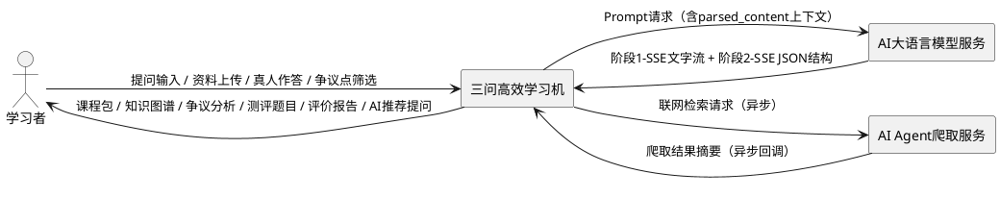
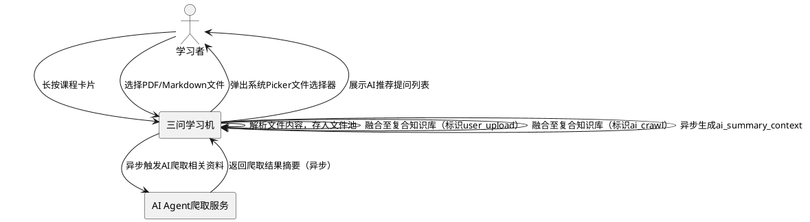
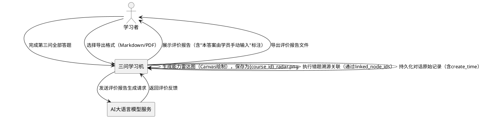
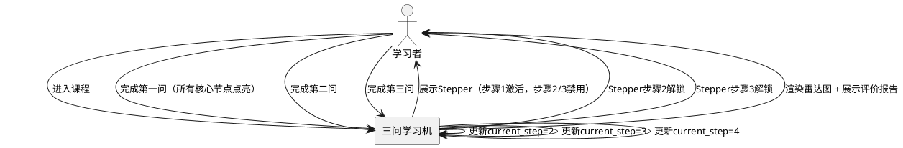

# 三问高效学习机 — EARS需求规格

> 版本：v2.1 | 日期：2026-06-02 | 语言：简体中文 | 补充数据库交付约束与Fix文档规范

---

# 1. 组件定位

## 1.1 核心职责
本组件负责驱动"三问认知引擎"学习流程，实现从问题触发到深度测评的个性化认知闭环。

## 1.2 核心输入
1. 用户提问输入：用户在主界面搜索框输入的领域问题文本
2. 用户资料上传：用户长按课程卡片后上传的PDF/Markdown等学习资料文 

## 1.4 职责边界
1. 不负责大语言模型本身的推理与训练，仅通过HTTP请求调用外部AI服务
2. 不负责外部网络爬取的调度逻辑，仅接收AI Agent返回的爬取结果摘要
3. 不负责多用户账号体系与权限管理，当前为单用户本地应用
4. 不负责在线社区、社交分享等协作功能
5. 不负责扫描型PDF的OCR解析，仅支持文本型PDF的纯文本提取

---

# 2. 领域术语

**三问认知引擎**
: 以"核心心智模型提取→学术分歧挖掘→深度测评生成"三步法驱动的认知闭环学习机制。

**柔性课程**
: 由用户提问触发、AI智能补充的动态生成课程包，具有已创建/活跃态/完成态三种生命周期状态。"未创建"等价于记录不存在。

**复合知识库**
: 用户上传资料与AI爬取资料融合后的统一数据源。

**文件池**
: 应用沙箱内存储用户上传资料和AI爬取资料的文件存储区域。

**心智模型**
: 对某领域核心概念及其逻辑关系的结构化抽象，以知识图谱形式可视化呈现。

**知识图谱**
: 由节点（概念）和连线（逻辑关系）构成的动态图结构。节点分为核心节点（core）和辅助节点（auxiliary）两种类型。

**知识节点激活**
: 知识图谱节点的两种状态：碎片态（is_activated=0，未点击）和点亮态（is_activated=1，已点击）。Q1完成条件为所有核心节点均被点亮。

**争议逻辑链**
: 以"争议-证据-结论"结构组织的学术分歧分析结果。

**布鲁姆认知层级**
: 记忆→理解→应用→分析→评价→创造六个递进认知深度层级。

**布鲁姆题目分布**
: 单次测评生成9道题，按认知层级分布为：记忆1题 + 理解2题 + 应用2题 + 分析2题 + 评价1题 + 创造1题。

**能力雷达图**
: 以"概念理解、批判思维、实践迁移"三维度绘制的学习效果可视化评价图。

**错题溯源**
: 将用户答错的题目通过linked_node_ids关联追溯到知识图谱中的薄弱节点。

**真人作答拦截**
: 在第二问发表见解和第三问答题时强制要求用户手动输入答案的机制，评价报告标注"本答案由学员手动输入"。

**拼图碎片动画**
: 第一问知识图谱生成时节点初始为"拼图碎片"状态的交互动画。

**心智塑成勋章**
: 用户完成整张知识图谱所有核心节点点击后弹出的成就动画。

**两阶段SSE策略**
: AI流式响应分为两阶段——阶段1以SSE流式输出文字描述（AI思考过程），前端逐字渲染；阶段2以SSE输出完整JSON结构（以特殊标记包裹），前端解析后渲染结构化内容。

**AI请求并发锁**
: 每个课程同一时刻只允许一个AI请求进行中，请求期间禁用触发按钮并显示加载状态。

**课程级联删除**
: 删除课程时级联删除所有关联数据表记录，并清理文件池中对应的物理文件。

---

# 3. 角色与边界

## 3.1 核心角色
- **学习者**：通过提问触发课程生成、上传学习资料、在三问流程中作答并获取评价报告的终端用户

## 3.2 外部系统
- **AI大语言模型服务**：接收Prompt请求，返回知识图谱JSON、争议分析结果、测评题目与评价反馈（两阶段SSE流式）
- **AI Agent爬取服务**：根据课程主题自动联网检索相关资料，返回爬取结果摘要（异步操作）

## 3.3 交互上下文



---

# 4. DFX约束

## 4.1 性能

**REQ-DFX-P01**：When 学习者提交问题输入，the 三问学习机 shall 在5秒内返回课程创建确认并展示课程卡片。

**REQ-DFX-P02**：When 三问认知引擎触发任一问的AI请求，the 三问学习机 shall 在15秒内完成AI请求并渲染对应内容。

**REQ-DFX-P03**：While 单课程知识图谱包含不少于50个节点，the 三问学习机 shall 保持界面无卡顿，渲染帧率不低于30fps。

**REQ-DFX-P04**：When 学习者上传资料文件，the 三问学习机 shall 在10秒内完成文件解析与入库。

## 4.2 可靠性

**REQ-DFX-R01**：If AI服务请求超时或失败，the 三问学习机 shall 显示友好错误提示并提供重试操作入口。

**REQ-DFX-R02**：The 三问学习机 shall 将所有用户真实作答和AI评价反馈持久化存入本地数据库，应用重启后数据不丢失。

**REQ-DFX-R03**：The 三问学习机 shall 保证数据库操作的原子性，事务执行要么全部成功要么全部回滚。

**REQ-DFX-R04**：When 删除课程，the 三问学习机 shall 级联删除该课程关联的所有数据表记录（knowledge_node、knowledge_edge、controversy、quiz_question、question_record、material、ai_request_log），并清理文件池中对应的物理文件。

## 4.3 安全性

**REQ-DFX-S01**：The 三问学习机 shall 将用户上传资料存储在应用沙箱目录内。

**REQ-DFX-S02**：The 三问学习机 shall 使用HTTPS加密传输所有AI服务HTTP请求。

**REQ-DFX-S03**：The 三问学习机 shall 禁止将用户真实作答内容通过AI自动生成替代。

## 4.4 可维护性

**REQ-DFX-M01**：The 三问学习机 shall 记录所有AI服务调用的请求与响应日志至ai_request_log表，包含请求类型、请求Prompt、响应内容、执行状态（success/failed/timeout）、耗时毫秒数和创建时间。

**REQ-DFX-M02**：The 三问学习机 shall 采用ArkTS声明式UI范式开发，代码结构符合Stage模型规范。

## 4.5 兼容性

**REQ-DFX-C01**：The 三问学习机 shall 运行于HarmonyOS API 12（HarmonyOS NEXT）及以上版本。

**REQ-DFX-C02**：The 三问学习机 shall 支持PDF和Markdown两种资料格式的上传与解析，其中PDF仅支持文本型PDF的纯文本提取。

**REQ-DFX-C03**：If 学习者上传扫描型PDF，the 三问学习机 shall 提示"该PDF为图片格式，暂不支持解析"。

## 4.6 权限声明

**REQ-DFX-A01**：The 三问学习机 shall 在module.json5中声明ohos.permission.INTERNET网络权限。

**REQ-DFX-A02**：The 三问学习机 shall 优先采用系统Picker方式选择文件。

## 4.7 数据库持久化与交付约束

**REQ-DFX-D01**：When 应用首次启动，the 三问学习机 shall 执行本地init.sql脚本完成建表初始化。

**REQ-DFX-D02**：The 三问学习机 shall 在项目根目录包含database/init.sql建表脚本文件。

**REQ-DFX-D03**：The 三问学习机 shall 在项目根目录包含DemoFilePool/文件夹。

**REQ-DFX-D04**：The 三问高效学习机 shall 在项目源码包中包含database/init.sql建表脚本和DemoFilePool/预置资料文件夹作为交付物。

## 4.8 AI请求并发控制

**REQ-DFX-CC01**：While 某课程的AI请求正在进行中，the 三问学习机 shall 禁止该课程发起新的AI请求，并禁用触发按钮、显示加载状态。

## 4.9 Fix过程文档规范

**REQ-DFX-F01**：The 三问高效学习机 shall 在项目交付物中包含docs/FIX_LOG.md文档，每个Bug修复记录包含问题ID、严重程度、触发条件、修复方案和测试结果。

**REQ-DFX-F02**：When 开发过程中发现并修复Bug，the 三问学习机 shall 按Fix记录模板将修复信息追加至docs/FIX_LOG.md，模板字段包括：问题ID（格式FIX-NNN）、严重程度（critical/major/minor）、触发条件（复现步骤）、修复方案（修改内容描述）、测试结果（验证是否通过）。

---

# 5. 核心能力

## 5.1 柔性课程生成

### 5.1.1 业务规则

1. **主界面极简规则**：主界面仅包含搜索框与引导语，不展示其他冗余元素。
   - 验收条件：[学习者打开应用主界面] → [仅显示搜索框和引导语文本，无其他业务元素]

2. **提问触发课程生成规则**：用户在搜索框输入问题后即时触发专属课程包生成，课程初始状态为"已创建"。
   - 验收条件：[学习者在搜索框输入问题并提交] → [系统生成专属课程包（status=已创建，current_step=0）并展示课程卡片]

3. **AI智能补充异步规则**：课程创建后，后台AI Agent异步联网检索相关资料补充复合知识库，不阻塞用户操作。
   - 验收条件：[课程包创建成功] → [后台异步触发AI Agent联网检索相关资料，用户可继续其他操作]

4. **AI摘要上下文异步生成规则**：AI Agent爬取完成后，异步生成ai_summary_context字段内容。
   - 验收条件：[AI Agent爬取结果返回] → [系统异步生成ai_summary_context并更新Course记录]

5. **课程生命周期规则**：柔性课程具有三种状态——已创建、活跃态、完成态，"未创建"等价于记录不存在。状态按序流转：已创建→活跃态→完成态。
   - 验收条件：[课程从初始到完成] → [状态依次经过：已创建→活跃态→完成态，不存在"未创建"状态记录]

6. **课程卡片信息规则**：课程卡片必须展示课程名称、进度条、能力雷达图缩略图。
   - 验收条件：[课程已创建] → [课程卡片显示课程名称、进度条、能力雷达图缩略图]

7. **课程进度计算规则**：第一问完成进度为33%，第二问完成进度为66%，第三问完成进度为100%。
   - 验收条件：[第一问完成] → [进度条显示33%]；[第二问完成] → [进度条显示66%]；[第三问完成] → [进度条显示100%]

8. **三问进度追踪规则**：Course表通过current_step字段追踪三问进度：0=未开始，1=Q1中，2=Q2中，3=Q3中，4=已完成。
   - 验收条件：[课程创建] → [current_step=0]；[进入第一问] → [current_step=1]；[进入第二问] → [current_step=2]；[进入第三问] → [current_step=3]；[三问完成] → [current_step=4]

9. **Q1完成条件规则**：第一问完成的充要条件是知识图谱中所有核心节点（type=core）均被点亮（is_activated=1），此为Q1→Q2解锁的必要条件。
   - 验收条件：[所有核心节点is_activated=1] → [Q1完成，解锁Q2]；[存在核心节点is_activated=0] → [Q1未完成，Q2锁定]

10. **Q1核心节点计数规则**：Course表通过q1_activated_count和q1_total_core_count字段追踪Q1进度。
    - 验收条件：[学习者点亮一个核心节点] → [q1_activated_count+1]；[知识图谱生成完成] → [q1_total_core_count=核心节点总数]

11. **课程级联删除规则**：删除课程时级联删除所有关联数据表记录，并清理文件池中对应的物理文件。
    - 验收条件：[学习者删除某课程] → [该课程及关联的knowledge_node、knowledge_edge、controversy、quiz_question、question_record、material、ai_request_log记录全部删除，文件池中对应物理文件全部清理]

### 5.1.2 交互流程

```plantuml
@startuml
actor "学习者" as L
rectangle "三问学习机" as App
rectangle "AI Agent爬取服务" as Agent

L -> App : 输入领域问题并提交
App -> App : 创建课程包（status：已创建，current_step：0）
App -> Agent : 异步触发联网检索相关资料
App --> L : 展示课程卡片（不等待AI Agent返回）
... 异步回调 ...
Agent --> App : 返回爬取结果摘要
App -> App : 融合资料至复合知识库
App -> App : 异步生成ai_summary_context
@enduml
```

### 5.1.3 异常场景

1. **问题输入为空**
   - 触发条件：学习者未输入任何文本即提交
   - 系统行为：拦截提交请求，不触发课程生成
   - 用户感知：搜索框下方提示"请输入您想学习的领域问题"

2. **AI Agent检索失败**
   - 触发条件：AI Agent联网检索请求超时或返回错误
   - 系统行为：课程包仍正常创建，复合知识库仅包含用户上传资料，记录错误日志至ai_request_log
   - 用户感知：课程卡片正常展示，提示"AI补充资料获取失败，可手动上传资料"

---

## 5.2 三问认知引擎

### 5.2.1 业务规则

1. **三问强制顺序规则**：三问必须按第一问→第二问→第三问顺序执行，不可跳步。
   - 验收条件：[学习者尝试直接进入第三问] → [系统拦截并提示需先完成前序步骤]

2. **进度强管控规则**：使用Stepper组件展示进度，完成前一问才解锁下一问。
   - 验收条件：[第一问未完成] → [第二问和第三问Stepper步骤处于锁定状态]

3. **第一问-核心心智模型提取规则**：分析复合知识库，生成动态知识图谱，节点持久化至knowledge_node表，边持久化至knowledge_edge表。
   - 验收条件：[学习者进入第一问] → [系统分析复合知识库并生成知识图谱，节点和边分别存入knowledge_node和knowledge_edge表]

4. **知识图谱数据结构规则**：知识图谱必须包含nodes（含id、label、type、description、is_activated、sort_order）和edges（含id、source、target、relation）。
   - 验收条件：[知识图谱生成完成] → [图谱数据包含nodes数组和edges数组，且各字段完整]

5. **知识节点类型规则**：知识图谱节点分为核心节点（type=core）和辅助节点（type=auxiliary），初始均为碎片态（is_activated=0）。
   - 验收条件：[知识图谱生成完成] → [每个节点的type为core或auxiliary，is_activated初始为0]

6. **拼图碎片动画规则**：知识图谱节点初始为"拼图碎片"状态，点击后飞向连线并点亮（is_activated更新为1）。
   - 验收条件：[知识图谱首次渲染] → [节点显示为拼图碎片状态]；[学习者点击某碎片节点] → [碎片飞向对应连线并点亮该节点，is_activated更新为1]

7. **心智塑成勋章规则**：学习者完成整张知识图谱所有核心节点点击后弹出成就动画。
   - 验收条件：[学习者点击知识图谱最后一个核心节点] → [弹出心智塑成勋章成就动画]

8. **Q1完成判定规则**：当q1_activated_count等于q1_total_core_count时，Q1完成，解锁Q2，current_step更新为2。
   - 验收条件：[q1_activated_count = q1_total_core_count] → [Q1完成，current_step更新为2，解锁Q2]

9. **第二问-学术分歧挖掘规则**：左右分栏呈现争议观点，生成"争议-证据-结论"逻辑链，结果持久化至controversy表。
   - 验收条件：[学习者进入第二问] → [系统以左右分栏展示争议观点，并呈现争议逻辑链，结果存入controversy表]

10. **争议点筛选规则**：学习者可在第二问中筛选感兴趣的争议点，选中项is_selected更新为1。
    - 验收条件：[第二问展示多个争议点] → [学习者可选择/取消选择特定争议点，is_selected相应更新]

11. **第二问真人见解输入规则**：第二问必须提供文本输入框，学习者手动输入见解。
    - 验收条件：[学习者进入第二问争议分析界面] → [显示文本输入框，且仅接受手动键盘输入]

12. **第三问-深度测评生成规则**：基于布鲁姆认知层级生成自测题，题目持久化至quiz_question表，共9题按层级分布：记忆1题+理解2题+应用2题+分析2题+评价1题+创造1题。
    - 验收条件：[学习者进入第三问] → [系统生成9道自测题，各层级数量为记忆1+理解2+应用2+分析2+评价1+创造1，存入quiz_question表]

13. **测评题目关联知识节点规则**：每道测评题目通过linked_node_ids（JSON数组）关联知识图谱节点，用于错题溯源。
    - 验收条件：[测评题目生成完成] → [每题的linked_node_ids包含关联的知识节点ID数组]

14. **即时答题与解析规则**：提交答案后立即显示答案解析，作答记录持久化至question_record表（含create_time时间戳）。
    - 验收条件：[学习者提交第三问答案] → [系统立即显示该题答案解析，记录存入question_record表含create_time字段]

15. **错题溯源规则**：答错题目通过linked_node_ids关联追溯到知识图谱中的薄弱节点。
    - 验收条件：[学习者第三问答错某题] → [系统通过该题的linked_node_ids将错题关联到知识图谱对应薄弱节点并标注]

16. **第三问真人作答拦截规则**：第三问仅提供手动文本输入框，禁止AI代答。
    - 验收条件：[学习者进入第三问答题界面] → [仅显示手动文本输入框，无AI自动填充功能]

17. **AI上下文注入规则（防幻觉）**：请求AI服务的Prompt中必须注入parsed_content作为上下文。
    - 验收条件：[系统向AI服务发送请求] → [Prompt中包含parsed_content字段作为上下文约束]

18. **两阶段SSE流式输出规则**：AI流式响应分为两阶段——阶段1以SSE流式输出文字描述（AI思考过程），前端逐字渲染；阶段2以SSE输出完整JSON结构（以特殊标记包裹），前端解析后渲染结构化内容。
    - 验收条件：[AI服务返回流式响应] → [阶段1：前端逐字渲染文字描述；阶段2：前端解析JSON结构后渲染结构化内容]

19. **AI请求并发控制规则**：每个课程同一时刻只允许一个AI请求进行中，请求期间禁用触发按钮并显示加载状态。
    - 验收条件：[某课程AI请求进行中] → [该课程的AI触发按钮禁用，显示加载状态]；[AI请求完成] → [触发按钮恢复可用]

### 5.2.2 交互流程

```plantuml
@startuml
actor "学习者" as L
rectangle "三问学习机" as App
rectangle "AI大语言模型服务" as AI

== 第一问：核心心智模型提取 ==
L -> App : 进入第一问
App -> App : 检查AI请求并发锁（无进行中请求）
App -> AI : 发送Prompt（含parsed_content上下文）
AI --> App : 阶段1-SSE流式文字描述
App --> L : 逐字渲染AI思考过程
AI --> App : 阶段2-SSE完整JSON（特殊标记包裹）
App -> App : 解析JSON，存入knowledge_node和knowledge_edge表
App --> L : 渲染拼图碎片动画 + 知识图谱
L -> App : 逐个点击碎片节点
App -> App : 更新is_activated=1，q1_activated_count+1
App --> L : 碎片飞向连线并点亮
L -> App : 完成所有核心节点点击
App -> App : 判定q1_activated_count=q1_total_core_count，更新current_step=2
App --> L : 弹出心智塑成勋章

== 第二问：学术分歧挖掘 ==
L -> App : 进入第二问（Q1已完成，current_step=2）
App -> App : 检查AI请求并发锁
App -> AI : 发送Prompt请求争议分析
AI --> App : 阶段1-SSE流式文字描述
App --> L : 逐字渲染AI思考过程
AI --> App : 阶段2-SSE完整JSON
App -> App : 解析JSON，存入controversy表
App --> L : 左右分栏展示争议观点 + 争议逻辑链
L -> App : 筛选争议点（更新is_selected）+ 手动输入见解
App -> AI : 发送见解评价请求
AI --> App : 返回见解评价反馈

== 第三问：深度测评生成 ==
L -> App : 进入第三问（Q2已完成，current_step=3）
App -> App : 检查AI请求并发锁
App -> AI : 发送Prompt请求测评题目
AI --> App : 阶段1-SSE流式文字描述
App --> L : 逐字渲染AI思考过程
AI --> App : 阶段2-SSE完整JSON
App -> App : 解析JSON，存入quiz_question表（9题，含linked_node_ids）
App --> L : 展示基于布鲁姆层级的自测题（记忆1+理解2+应用2+分析2+评价1+创造1）
L -> App : 手动输入答案并提交
App -> App : 记录存入question_record表（含quiz_question_id和create_time）
App -> AI : 发送答案评价请求
AI --> App : 返回答案解析与评价
App --> L : 即时显示答案解析 + 错题溯源标注（通过linked_node_ids）
@enduml
```

### 5.2.3 异常场景

1. **AI服务请求超时**
   - 触发条件：AI大语言模型服务在15秒内未返回响应
   - 系统行为：中断当前请求，记录超时日志至ai_request_log（status=timeout），释放AI请求并发锁
   - 用户感知：显示"AI服务响应超时，请检查网络后重试"，提供重试按钮

2. **AI服务返回格式异常**
   - 触发条件：AI返回的JSON不符合预期的知识图谱/争议分析/测评题目数据结构
   - 系统行为：记录原始响应日志至ai_request_log（status=failed），尝试降级解析或提示重试，释放并发锁
   - 用户感知：显示"AI生成内容异常，请重试"

3. **学习者跳步操作**
   - 触发条件：学习者尝试直接进入未解锁的下一问
   - 系统行为：拦截跳步操作，保持当前步骤
   - 用户感知：提示"请先完成当前步骤后再进入下一步"

4. **知识图谱节点为空**
   - 触发条件：复合知识库内容不足以生成知识图谱节点
   - 系统行为：提示学习者补充学习资料
   - 用户感知：显示"当前资料不足以生成知识图谱，请上传更多学习资料"

5. **AI请求并发冲突**
   - 触发条件：某课程已有AI请求进行中时，学习者再次触发AI请求
   - 系统行为：拒绝新请求，保持现有请求继续执行
   - 用户感知：触发按钮禁用，显示加载状态

---

## 5.3 复合知识库与文件池

### 5.3.1 业务规则

1. **资料上传触发规则**：学习者长按课程卡片触发资料上传功能。
   - 验收条件：[学习者长按课程卡片] → [弹出文件选择器，支持PDF和Markdown格式]

2. **资料动态融合规则**：用户上传资料与AI爬取资料融合为统一复合知识库。
   - 验收条件：[用户上传资料且AI爬取资料均存在] → [两类资料融合为统一数据源供三问引擎使用]

3. **资料类型标识规则**：每份资料必须标识来源类型——用户上传（user_upload）或AI爬取（ai_crawl）。
   - 验收条件：[资料入库] → [资料记录的type字段为user_upload或ai_crawl]

4. **AI推荐提问规则**：基于已有资料自动生成探索性问题列表。
   - 验收条件：[复合知识库中存在资料] → [系统自动生成探索性问题列表供学习者选择]

5. **文件大小限制规则**：单个上传文件不超过50MB。
   - 验收条件：[学习者选择超过50MB的文件] → [系统拒绝上传并提示"文件大小超过50MB限制"]

6. **文件命名规则**：保留原始文件名，重名文件追加时间戳后缀。
   - 验收条件：[上传与文件池中已有文件同名的文件] → [新文件名追加时间戳后缀存储]

7. **PDF解析能力边界规则**：仅支持文本型PDF的纯文本提取，扫描型PDF提示不支持。
   - 验收条件：[上传文本型PDF] → [正常提取纯文本内容]；[上传扫描型PDF] → [提示"该PDF为图片格式，暂不支持解析"]

### 5.3.2 交互流程



### 5.3.3 异常场景

1. **文件格式不支持**
   - 触发条件：学习者选择非PDF/Markdown格式的文件
   - 系统行为：拒绝文件上传
   - 用户感知：提示"仅支持PDF和Markdown格式文件"

2. **文件解析失败**
   - 触发条件：PDF/Markdown文件内容损坏或无法正常解析
   - 系统行为：标记资料状态为failed，记录错误日志
   - 用户感知：提示"文件解析失败，请检查文件是否损坏"

3. **文件存储空间不足**
   - 触发条件：应用沙箱存储空间不足以保存上传文件
   - 系统行为：拒绝文件保存
   - 用户感知：提示"存储空间不足，请清理后重试"

4. **扫描型PDF上传**
   - 触发条件：学习者上传的PDF为扫描图片格式，无法提取文本
   - 系统行为：拒绝文本提取，标记资料状态为failed
   - 用户感知：提示"该PDF为图片格式，暂不支持解析"

---

## 5.4 学习效果评价与记录

### 5.4.1 业务规则

1. **真人作答拦截规则**：第二问和第三问仅提供手动文本输入框，不接受AI自动生成内容。
   - 验收条件：[学习者进入第二问或第三问作答界面] → [仅显示手动文本输入框]

2. **粘贴板最佳努力禁用规则**：技术上尽力禁用粘贴板（最佳努力措施），Prompt约束层面加强防套娃，评价报告标注"本答案由学员手动输入"。
   - 验收条件：[学习者尝试粘贴内容到作答输入框] → [粘贴操作尽力拦截（最佳努力）]；[AI请求Prompt] → [包含禁止替代用户作答的约束指令]；[评价报告生成] → [报告标注"本答案由学员手动输入"]

3. **对话原始记录持久化规则**：用户真实作答和AI评价反馈原封不动存入本地数据库，每条记录包含create_time时间戳。
   - 验收条件：[学习者提交作答且AI返回评价] → [用户原文和AI评价原文完整存入question_record表，含create_time字段]

4. **评价报告生成规则**：第三问完成后生成含能力雷达图与错题溯源的评价报告。
   - 验收条件：[第三问全部完成] → [系统生成评价报告，包含能力雷达图和错题溯源]

5. **雷达图绘制与嵌入规则**：Canvas绘制"概念理解、批判思维、实践迁移"三维度雷达图，保存为{course_id}_radar.png，评价报告Markdown中使用相对路径嵌入。
   - 验收条件：[评价报告生成] → [雷达图保存为{course_id}_radar.png，Markdown中以相对路径嵌入]

6. **评价报告导出规则**：评价报告支持Markdown或PDF格式导出。
   - 验收条件：[学习者选择导出评价报告] → [可选择Markdown或PDF格式导出]

7. **评价报告标准模板规则**：评价报告必须包含学习课题、复合知识库构成、三问交互原始记录、能力维度分析、错题溯源与复习建议，并标注"本答案由学员手动输入"。
   - 验收条件：[评价报告生成] → [报告包含：学习课题、复合知识库构成、三问交互原始记录、能力维度分析、错题溯源与复习建议、"本答案由学员手动输入"标注]

### 5.4.2 交互流程



### 5.4.3 异常场景

1. **评价报告导出失败**
   - 触发条件：设备存储空间不足或文件写入异常
   - 系统行为：记录错误日志，中断导出流程
   - 用户感知：提示"报告导出失败，请检查存储空间后重试"

2. **雷达图绘制异常**
   - 触发条件：能力维度数据缺失或异常导致Canvas绘制失败
   - 系统行为：使用默认值降级绘制或显示数据异常提示
   - 用户感知：雷达图正常显示或提示"评价数据异常，雷达图可能不完整"

---

## 5.5 系统心智与可视化

### 5.5.1 业务规则

1. **Stepper进度管控规则**：Stepper严格限制流程1→2→3，未完成前序步骤不可进入后续步骤。
   - 验收条件：[第一问未完成] → [Stepper步骤2和3处于禁用状态]

2. **知识图谱Canvas渲染规则**：知识图谱使用Canvas渲染，支持节点点击和连线查看。
   - 验收条件：[知识图谱渲染完成] → [学习者可点击节点查看详情，可点击连线查看关系描述]

3. **雷达图Canvas绘制规则**：能力雷达图使用Canvas绘制三维度图形，保存为{course_id}_radar.png。
   - 验收条件：[评价报告生成] → [Canvas绘制概念理解/批判思维/实践迁移三维度雷达图，保存为{course_id}_radar.png]

4. **拼图碎片动画规则**：第一问知识图谱节点初始为拼图碎片状态，点击触发飞向连线并点亮动画。
   - 验收条件：[第一问知识图谱首次渲染] → [节点为拼图碎片状态]；[点击碎片] → [播放飞向连线并点亮动画，is_activated更新为1]

5. **心智塑成勋章动画规则**：所有核心节点点击完成后弹出成就动画。
   - 验收条件：[最后一个核心节点被点亮] → [弹出心智塑成勋章成就动画]

6. **AI推荐提问按钮规则**：基于已有资料自动生成探索性问题，以按钮形式展示。
   - 验收条件：[复合知识库非空] → [主界面或课程界面展示AI推荐提问按钮列表]

### 5.5.2 交互流程



### 5.5.3 异常场景

1. **Canvas渲染失败**
   - 触发条件：设备GPU资源不足或Canvas上下文创建失败
   - 系统行为：降级为文本列表展示知识图谱节点信息
   - 用户感知：以文本列表形式展示图谱内容，提示"图形渲染异常，已切换为列表模式"

2. **动画资源加载失败**
   - 触发条件：拼图碎片或勋章动画资源文件缺失
   - 系统行为：跳过动画，直接展示最终状态
   - 用户感知：节点直接显示为点亮状态，无过渡动画

---

# 6. 数据约束

## 6.1 Course

1. **id**：课程唯一标识，必填，全局唯一
2. **title**：课程标题，必填，最大200字符
3. **status**：课程状态，必填，取值范围为{已创建, 活跃态, 完成态}，"未创建"等价于记录不存在
4. **create_time**：创建时间，必填，ISO 8601格式
5. **progress**：课程进度，必填，取值范围为0~100的整数
6. **ai_summary_context**：课程摘要上下文，选填，AI爬取完成后异步生成
7. **current_step**：三问进度步骤，必填，取值范围为{0, 1, 2, 3, 4}，0=未开始，1=Q1中，2=Q2中，3=Q3中，4=已完成，默认0
8. **q1_activated_count**：Q1已点亮核心节点数，必填，非负整数，默认0
9. **q1_total_core_count**：Q1核心节点总数，必填，非负整数，默认0

## 6.2 KnowledgeNode

1. **id**：节点唯一标识，必填，全局唯一
2. **course_id**：所属课程标识，必填，关联Course.id
3. **label**：节点标签名称，必填，最大100字符
4. **type**：节点类型，必填，取值范围为{core, auxiliary}，core=核心节点，auxiliary=辅助节点
5. **description**：节点描述，选填
6. **is_activated**：激活状态，必填，取值范围为{0, 1}，0=碎片态（未点击），1=点亮态（已点击），默认0
7. **sort_order**：排序序号，必填，非负整数

## 6.3 KnowledgeEdge

1. **id**：边唯一标识，必填，全局唯一
2. **course_id**：所属课程标识，必填，关联Course.id
3. **source**：起始节点标识，必填，关联KnowledgeNode.id
4. **target**：终止节点标识，必填，关联KnowledgeNode.id
5. **relation**：关系描述，必填，最大200字符

## 6.4 Controversy

1. **id**：争议点唯一标识，必填，全局唯一
2. **course_id**：所属课程标识，必填，关联Course.id
3. **title**：争议点标题，必填，最大200字符
4. **view_a**：观点A，必填
5. **evidence_a**：观点A证据，必填
6. **view_b**：观点B，必填
7. **evidence_b**：观点B证据，必填
8. **conclusion**：结论，必填
9. **is_selected**：是否被学习者选中，必填，取值范围为{0, 1}，默认0
10. **sort_order**：排序序号，必填，非负整数

## 6.5 QuizQuestion

1. **id**：题目唯一标识，必填，全局唯一
2. **course_id**：所属课程标识，必填，关联Course.id
3. **bloom_level**：布鲁姆认知层级，必填，取值范围为{remember, understand, apply, analyze, evaluate, create}
4. **content**：题目内容，必填
5. **standard_answer**：标准答案，必填
6. **linked_node_ids**：关联知识节点ID数组，必填，JSON数组格式，每个元素关联KnowledgeNode.id
7. **sort_order**：排序序号，必填，非负整数

## 6.6 QuestionRecord

1. **id**：记录唯一标识，必填，全局唯一
2. **course_id**：所属课程标识，必填，关联Course.id
3. **step**：三问步骤，必填，取值范围为{1, 2, 3}
4. **quiz_question_id**：关联测评题目标识，选填，关联QuizQuestion.id（第三问作答时必填）
5. **question_content**：题目/争议点原文，必填
6. **user_original_answer**：用户真实作答原文，必填
7. **ai_evaluation**：AI评价反馈原文，必填
8. **standard_answer**：标准答案，选填
9. **is_correct**：作答是否正确，必填，取值范围为{true, false, pending, subjective}
10. **create_time**：记录创建时间，必填，ISO 8601格式

## 6.7 Material

1. **id**：资料唯一标识，必填，全局唯一
2. **course_id**：所属课程标识，必填，关联Course.id
3. **file_name**：资料文件名，必填，最大255字符
4. **file_path**：沙箱存储路径，必填，最大500字符
5. **type**：来源类型，必填，取值范围为{user_upload, ai_crawl}
6. **status**：资料状态，必填，取值范围为{pending, parsing, success, failed}
7. **parsed_content**：解析后纯文本，选填

## 6.8 AiRequestLog

1. **id**：日志唯一标识，必填，全局唯一
2. **course_id**：关联课程标识，选填，关联Course.id
3. **request_type**：请求类型，必填，标识AI请求的业务类型（如knowledge_graph、controversy、quiz、evaluation等）
4. **request_prompt**：请求Prompt内容，必填
5. **response_body**：响应内容，选填
6. **status**：执行状态，必填，取值范围为{success, failed, timeout}
7. **duration_ms**：耗时毫秒数，必填，非负整数
8. **create_time**：创建时间，必填，ISO 8601格式

## 6.9 文件池

1. **存储位置**：应用沙箱目录内
2. **支持格式**：PDF（仅文本型）、Markdown
3. **文件大小**：单个文件不超过50MB
4. **文件命名**：保留原始文件名，重名追加时间戳后缀
5. **雷达图文件**：保存为{course_id}_radar.png，评价报告Markdown中以相对路径嵌入

---

# 7. 项目目录结构与交付物清单

## 7.1 项目目录结构

```
三问高效学习机/
├── entry/                      # HarmonyOS应用主模块
│   └── src/main/ets/           # ArkTS源码
├── database/                   # 数据库脚本
│   └── init.sql                # 建表脚本（课程、知识图谱、争议、测评等全部表结构）
├── DemoFilePool/               # 预置示例资料文件
│   ├── sample_course_01.pdf    # 示例PDF学习资料
│   └── sample_course_01.md     # 示例Markdown学习资料
├── docs/                       # 项目文档
│   ├── FIX_LOG.md              # Bug修复过程记录文档
│   └── ...                     # 其他文档
└── ...
```

## 7.2 交付物清单

| 序号 | 交付物 | 路径 | 说明 |
|------|--------|------|------|
| 1 | 应用源码 | entry/src/main/ets/ | ArkTS声明式UI源码，符合HarmonyOS Stage模型规范 |
| 2 | 数据库建表脚本 | database/init.sql | 包含全部表结构的SQL建表脚本，应用首次启动时执行 |
| 3 | 预置示例资料 | DemoFilePool/ | 预置示例PDF/Markdown学习资料文件，供演示和测试使用 |
| 4 | Fix过程文档 | docs/FIX_LOG.md | Bug修复过程记录，每条记录含问题ID、严重程度、触发条件、修复方案、测试结果 |
| 5 | 评价报告 | 运行时生成 | Markdown/PDF格式，含能力雷达图与错题溯源 |

---

# 8. EARS需求汇总

## 8.1 功能需求

### 8.1.1 柔性课程生成

**REQ-FC-01**：When 学习者在主界面搜索框输入领域问题并提交，the 三问学习机 shall 即时生成专属课程包（status=已创建，current_step=0）并展示课程卡片。

**REQ-FC-02**：When 课程包创建成功，the 三问学习机 shall 异步触发后台AI Agent联网检索相关资料补充复合知识库，不阻塞用户操作。

**REQ-FC-03**：When AI Agent爬取结果返回，the 三问学习机 shall 异步生成ai_summary_context并更新Course记录。

**REQ-FC-04**：While 课程处于已创建状态，the 三问学习机 shall 在课程卡片上展示课程名称、进度条和能力雷达图缩略图。

**REQ-FC-05**：When 第一问完成，the 三问学习机 shall 将课程进度更新为33%。

**REQ-FC-06**：When 第二问完成，the 三问学习机 shall 将课程进度更新为66%。

**REQ-FC-07**：When 第三问完成，the 三问学习机 shall 将课程进度更新为100%。

**REQ-FC-08**：The 三问学习机 shall 主界面仅包含搜索框与引导语。

**REQ-FC-09**：The 三问学习机 shall 柔性课程状态取值范围为{已创建, 活跃态, 完成态}，"未创建"等价于记录不存在。

**REQ-FC-10**：When 学习者进入第一问，the 三问学习机 shall 更新current_step为1。

**REQ-FC-11**：When 第一问完成（所有核心节点点亮），the 三问学习机 shall 更新current_step为2并解锁第二问。

**REQ-FC-12**：When 第二问完成，the 三问学习机 shall 更新current_step为3并解锁第三问。

**REQ-FC-13**：When 第三问完成，the 三问学习机 shall 更新current_step为4。

**REQ-FC-14**：When 学习者删除课程，the 三问学习机 shall 级联删除该课程关联的所有数据表记录（knowledge_node、knowledge_edge、controversy、quiz_question、question_record、material、ai_request_log），并清理文件池中对应的物理文件。

### 8.1.2 三问认知引擎 — 第一问

**REQ-FC-15**：When 学习者进入第一问，the 三问学习机 shall 分析复合知识库并生成动态知识图谱，节点持久化至knowledge_node表，边持久化至knowledge_edge表。

**REQ-FC-16**：When 知识图谱首次渲染，the 三问学习机 shall 将所有节点初始显示为拼图碎片状态（is_activated=0）。

**REQ-FC-17**：When 学习者点击拼图碎片节点，the 三问学习机 shall 播放碎片飞向连线并点亮该节点的动画，并将is_activated更新为1、q1_activated_count加1。

**REQ-FC-18**：When 学习者点击完成知识图谱最后一个核心节点，the 三问学习机 shall 弹出心智塑成勋章成就动画。

**REQ-FC-19**：The 三问学习机 shall 知识图谱数据结构包含nodes数组（每项含id、label、type、description、is_activated、sort_order）和edges数组（每项含id、source、target、relation）。

**REQ-FC-20**：The 三问学习机 shall 知识图谱节点类型分为core（核心节点）和auxiliary（辅助节点）两种。

**REQ-FC-21**：When q1_activated_count等于q1_total_core_count，the 三问学习机 shall 判定第一问完成并解锁第二问。

### 8.1.3 三问认知引擎 — 第二问

**REQ-FC-22**：When 学习者进入第二问，the 三问学习机 shall 以左右分栏展示争议观点并生成"争议-证据-结论"争议逻辑链，结果持久化至controversy表。

**REQ-FC-23**：When 第二问展示多个争议点，the 三问学习机 shall 提供争议点筛选功能供学习者选择感兴趣的争议点，选中项is_selected更新为1。

**REQ-FC-24**：While 学习者处于第二问争议分析界面，the 三问学习机 shall 提供文本输入框且仅接受手动键盘输入的见解。

### 8.1.4 三问认知引擎 — 第三问

**REQ-FC-25**：When 学习者进入第三问，the 三问学习机 shall 基于布鲁姆认知层级生成9道自测题（记忆1+理解2+应用2+分析2+评价1+创造1），持久化至quiz_question表。

**REQ-FC-26**：The 三问学习机 shall 每道测评题目通过linked_node_ids（JSON数组）关联知识图谱节点，用于错题溯源。

**REQ-FC-27**：When 学习者提交第三问答案，the 三问学习机 shall 即时显示该题答案解析，并将作答记录（含quiz_question_id和create_time）存入question_record表。

**REQ-FC-28**：If 学习者第三问答错某题，the 三问学习机 shall 通过该题的linked_node_ids将错题关联追溯到知识图谱中的薄弱节点并标注。

**REQ-FC-29**：While 学习者处于第三问答题界面，the 三问学习机 shall 仅提供手动文本输入框，禁止AI自动填充答案。

### 8.1.5 三问流程管控

**REQ-FC-30**：The 三问学习机 shall 三问按第一问→第二问→第三问强制顺序执行，不可跳步。

**REQ-FC-31**：While 前一问未完成，the 三问学习机 shall 保持后续问的Stepper步骤处于锁定状态。

**REQ-FC-32**：When 前一问完成，the 三问学习机 shall 解锁下一问的Stepper步骤。

### 8.1.6 AI交互规则

**REQ-FC-33**：When 系统向AI服务发送请求，the 三问学习机 shall 在Prompt中注入parsed_content作为上下文以防止AI幻觉。

**REQ-FC-34**：While AI服务返回流式响应（SSE），the 三问学习机 shall 采用两阶段SSE策略——阶段1逐字渲染文字描述（AI思考过程），阶段2解析完整JSON结构（以特殊标记包裹）后渲染结构化内容。

**REQ-FC-35**：While 某课程的AI请求正在进行中，the 三问学习机 shall 禁止该课程发起新的AI请求，禁用触发按钮并显示加载状态。

**REQ-FC-36**：When AI请求完成或失败，the 三问学习机 shall 释放AI请求并发锁，恢复触发按钮可用状态。

### 8.1.7 复合知识库与文件池

**REQ-FC-37**：When 学习者长按课程卡片，the 三问学习机 shall 弹出系统Picker文件选择器，支持PDF和Markdown格式。

**REQ-FC-38**：When 用户上传资料和AI爬取资料均存在，the 三问学习机 shall 将两类资料融合为统一复合知识库。

**REQ-FC-39**：When 资料入库，the 三问学习机 shall 标识资料来源类型为user_upload或ai_crawl。

**REQ-FC-40**：While 复合知识库中存在资料，the 三问学习机 shall 自动生成探索性问题列表供学习者选择。

**REQ-FC-41**：If 学习者选择超过50MB的文件上传，the 三问学习机 shall 拒绝上传并提示文件大小超限。

**REQ-FC-42**：When 上传与文件池中已有文件同名的文件，the 三问学习机 shall 为新文件名追加时间戳后缀存储。

**REQ-FC-43**：If 学习者上传扫描型PDF，the 三问学习机 shall 提示"该PDF为图片格式，暂不支持解析"。

### 8.1.8 学习效果评价与记录

**REQ-FC-44**：While 学习者处于第二问或第三问作答界面，the 三问学习机 shall 仅提供手动文本输入框，不接受AI自动生成内容。

**REQ-FC-45**：If 学习者尝试粘贴内容到作答输入框，the 三问学习机 shall 尽力拦截粘贴操作（最佳努力措施）。

**REQ-FC-46**：When AI请求Prompt构建，the 三问学习机 shall 包含禁止替代用户作答的约束指令。

**REQ-FC-47**：When 学习者提交作答且AI返回评价，the 三问学习机 shall 将用户原文和AI评价原文完整存入question_record表，记录包含create_time时间戳。

**REQ-FC-48**：When 第三问全部完成，the 三问学习机 shall 生成含能力雷达图与错题溯源的评价报告，报告标注"本答案由学员手动输入"。

**REQ-FC-49**：When 评价报告生成，the 三问学习机 shall 使用Canvas绘制"概念理解、批判思维、实践迁移"三维度雷达图，保存为{course_id}_radar.png，Markdown中以相对路径嵌入。

**REQ-FC-50**：When 学习者选择导出评价报告，the 三问学习机 shall 支持Markdown或PDF格式导出。

**REQ-FC-51**：When 评价报告生成，the 三问学习机 shall 报告包含学习课题、复合知识库构成、三问交互原始记录、能力维度分析、错题溯源与复习建议、"本答案由学员手动输入"标注。

### 8.1.9 系统可视化

**REQ-FC-52**：While 知识图谱渲染完成，the 三问学习机 shall 支持节点点击查看详情和连线查看关系描述。

**REQ-FC-53**：While 复合知识库非空，the 三问学习机 shall 在界面展示AI推荐提问按钮列表。

## 8.2 非功能需求

### 8.2.1 性能需求

**REQ-NF-P01**：When 学习者提交问题输入，the 三问学习机 shall 在5秒内返回课程创建确认并展示课程卡片。

**REQ-NF-P02**：When 三问认知引擎触发任一问的AI请求，the 三问学习机 shall 在15秒内完成AI请求并渲染对应内容。

**REQ-NF-P03**：While 单课程知识图谱包含不少于50个节点，the 三问学习机 shall 保持界面渲染帧率不低于30fps。

**REQ-NF-P04**：When 学习者上传资料文件，the 三问学习机 shall 在10秒内完成文件解析与入库。

### 8.2.2 可靠性需求

**REQ-NF-R01**：If AI服务请求超时或失败，the 三问学习机 shall 显示友好错误提示并提供重试操作入口。

**REQ-NF-R02**：The 三问学习机 shall 将所有用户真实作答和AI评价反馈持久化存入本地数据库，应用重启后数据不丢失。

**REQ-NF-R03**：The 三问学习机 shall 保证数据库操作的原子性，事务执行要么全部成功要么全部回滚。

**REQ-NF-R04**：When 删除课程，the 三问学习机 shall 级联删除该课程关联的所有数据表记录并清理文件池中对应的物理文件。

### 8.2.3 安全性需求

**REQ-NF-S01**：The 三问学习机 shall 将用户上传资料存储在应用沙箱目录内。

**REQ-NF-S02**：The 三问学习机 shall 使用HTTPS加密传输所有AI服务HTTP请求。

**REQ-NF-S03**：The 三问学习机 shall 禁止将用户真实作答内容通过AI自动生成替代。

### 8.2.4 可维护性需求

**REQ-NF-M01**：The 三问学习机 shall 记录所有AI服务调用的请求与响应日志至ai_request_log表，包含请求类型、请求Prompt、响应内容、执行状态（success/failed/timeout）、耗时毫秒数和创建时间。

**REQ-NF-M02**：The 三问学习机 shall 采用ArkTS声明式UI范式开发，代码结构符合HarmonyOS Stage模型规范。

### 8.2.5 兼容性需求

**REQ-NF-C01**：The 三问学习机 shall 运行于HarmonyOS API 12（HarmonyOS NEXT）及以上版本。

**REQ-NF-C02**：The 三问学习机 shall 支持PDF和Markdown两种资料格式的上传与解析，其中PDF仅支持文本型PDF的纯文本提取。

**REQ-NF-C03**：If 学习者上传扫描型PDF，the 三问学习机 shall 提示"该PDF为图片格式，暂不支持解析"。

### 8.2.6 权限与交付需求

**REQ-NF-A01**：The 三问学习机 shall 在module.json5中声明ohos.permission.INTERNET网络权限。

**REQ-NF-A02**：The 三问学习机 shall 优先采用系统Picker方式选择文件。

**REQ-NF-D01**：When 应用首次启动，the 三问学习机 shall 执行本地init.sql脚本完成建表初始化。

**REQ-NF-D02**：The 三问学习机 shall 在项目根目录包含database/init.sql建表脚本文件。

**REQ-NF-D03**：The 三问学习机 shall 在项目根目录包含DemoFilePool/文件夹。

**REQ-NF-D04**：The 三问高效学习机 shall 在项目源码包中包含database/init.sql建表脚本和DemoFilePool/预置资料文件夹作为交付物。

### 8.2.7 AI请求并发控制需求

**REQ-NF-CC01**：While 某课程的AI请求正在进行中，the 三问学习机 shall 禁止该课程发起新的AI请求，禁用触发按钮并显示加载状态。

**REQ-NF-CC02**：When AI请求完成或失败，the 三问学习机 shall 释放AI请求并发锁并记录日志至ai_request_log表。

### 8.2.8 Fix过程文档需求

**REQ-NF-F01**：The 三问高效学习机 shall 在项目交付物中包含docs/FIX_LOG.md文档，每个Bug修复记录包含问题ID、严重程度、触发条件、修复方案和测试结果。

**REQ-NF-F02**：When 开发过程中发现并修复Bug，the 三问学习机 shall 按Fix记录模板将修复信息追加至docs/FIX_LOG.md，模板字段包括：问题ID（格式FIX-NNN）、严重程度（critical/major/minor）、触发条件（复现步骤）、修复方案（修改内容描述）、测试结果（验证是否通过）。
